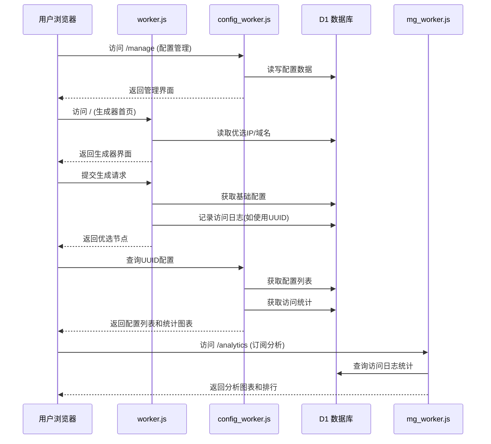

# Cloudflare Worker: 代理配置优选工具

        

这是一个运行在 Cloudflare Worker 上的多功能代理工具，结合 Cloudflare D1 数据库，提供**IP优选**和**域名优选**的批量替换功能。系统由3个文件组成：**worker.js** - 优选生成器、**config_worker.js** - 配置管理器、**mg_worker.js** - 管理后台。采用三 Worker 架构，分别处理优选生成、配置管理和系统管理，实现功能解耦和独立部署。

## 📦 系统组成

**系统由3个核心文件组成**：

- **`worker.js`** - 优选生成器：处理 IP/域名优选、订阅生成、批量配置替换、访问日志记录
- **`config_worker.js`** - 配置管理器：提供配置 CRUD 操作、订阅接口、配置编辑功能、UUID访问统计
- **`mg_worker.js`** - 管理后台：JWT 认证、域名/IP/UUID 管理、系统统计、手动 IP 更新、订阅访问统计分析

## ✨ 主要特性

### 1. **三 Worker 架构**

该系统由3个文件组成：**worker.js** - 优选生成器、**config_worker.js** - 配置管理器、**mg_worker.js** - 管理后台。

   *   **worker.js** - 优选生成器：处理 IP/域名优选、订阅生成、批量配置替换、访问日志记录
   *   **config_worker.js** - 配置管理器：提供配置 CRUD 操作、订阅接口、配置编辑功能，包含外部配置生成器链接和UUID访问统计
   *   **mg_worker.js** - 管理后台：JWT 认证、域名/IP/UUID 管理、系统统计、手动 IP 更新、订阅访问统计分析

### 2. **双模式优选**

   *   支持将配置中的地址批量替换为 **优选 IP** 或 **优选域名**
   *   支持 IPv4/IPv6 和不同运营商（电信/联通/移动）筛选
   *   支持通过管理后台手动更新 IP 数据源

### 3. **配置管理 (CRUD) [v1.2]**

   *   提供完整的管理界面，可添加、查询、编辑、删除基础配置（支持 VMess, VLESS, Trojan）
   *   按 UUID 分组管理，方便生成不同的订阅
   *   支持配置编辑功能，可修改别名、地址、端口、传输协议等参数
   *   提供配置生成器外部链接（"配置生成"按钮），链接到外部配置生成器（https://cfst.api.yangzifun.org）
   *   改进的订阅链接显示方式（使用可复制的输入框）
   *   统一的前端按钮样式

### 4. **动态订阅生成**

   *   提供 `/sub/{uuid}` 订阅接口，返回 Base64 编码的配置列表
   *   支持通过 URL 参数动态指定 IP 类型（IPv4/IPv6）或运营商（电信/联通/移动）
   *   支持批量添加配置，提高管理效率

### 5. **访问日志记录 [v2.0新增]**

   *   **完整的访问统计**：记录用户通过UUID生成配置的所有访问
   *   **双模式记录**：
       - 订阅链接访问 (`subscription`)
       - 网页API生成访问 (`api-generation`)
   *   **客户端信息收集**：记录客户端IP、User-Agent
   *   **实时统计API**：提供`/admin/stats`接口获取详细的访问统计数据
   *   **汇总分析**：支持按日期、UUID、访问类型进行多维度统计

### 6. **订阅分析功能 [v2.0新增]**

   *   **管理后台订阅分析**：在管理后台提供全局访问分析
   *   **配置页面UUID统计**：在配置管理页面为每个UUID提供专属统计图表
   *   **交互式趋势图表**：使用Chart.js可视化近7/14/30/60天的访问趋势
   *   **多维度分析**：
       - 总访问量趋势
       - 订阅访问 vs 网页生成访问对比
   *   **实时数据更新**：支持手动刷新统计数据
   *   **详细访问记录**：显示最近访问记录和客户端信息

### 7. **完整的数据管理**

   *   域名管理：添加、编辑、删除优选域名
   *   IP 资源池管理：查看、删除、刷新优选 IP
   *   UUID 分组管理：按 UUID 管理配置分组
   *   系统统计：实时查看域名、IP、UUID 数量统计

### 8. **安全特性**

*   JWT 认证系统，保障管理后台安全
*   **MFA双重验证**：
    - 支持TOTP(基于时间的一次性密码)验证
    - 管理员可启用/禁用MFA
    - 提供10个一次性备份码，防止验证器丢失
    - 支持使用备份码登录
*   响应式设计，适配桌面和移动设备
*   配置生成器外部链接跳转功能，提供一站式配置管理体验

## 🛠️ 部署准备

在使用此脚本之前，您需要：

1.  一个 **Cloudflare** 账号。
2.  启用 **Workers** 和 **D1 Database** 功能。

## 🚀 部署步骤

### 1. 创建 D1 数据库

在 Cloudflare 控制台的 "Workers & Pages" -> "D1" 中创建一个新的数据库（例如命名为 `proxy-db`）。

### 2. 初始化数据库 (SQL)

进入 D1 数据库的 "Console" 标签页，执行以下 SQL 语句以创建所需的表结构：

```sql
/* =================================================================
 *  D1 数据库建表 Schema
 * ================================================================= */

-- 用户表
CREATE TABLE IF NOT EXISTS admin_users (
    id INTEGER PRIMARY KEY AUTOINCREMENT,
    username TEXT UNIQUE,
    password_hash TEXT
);
-- 域名表
CREATE TABLE IF NOT EXISTS cf_domains (
    id INTEGER PRIMARY KEY AUTOINCREMENT,
    domain TEXT UNIQUE,
    remark TEXT,
    created_at INTEGER
);
-- UUID 配置表
CREATE TABLE IF NOT EXISTS configs (
    id INTEGER PRIMARY KEY AUTOINCREMENT,
    uuid TEXT,
    config TEXT, 
    created_at INTEGER
);
-- IP 池表
CREATE TABLE IF NOT EXISTS cfips (
    id INTEGER PRIMARY KEY AUTOINCREMENT,
    ip TEXT UNIQUE,
    ip_type TEXT,
    carrier TEXT,
    created_at INTEGER
);
-- 自动更新设置表 (v1.3新增)
CREATE TABLE IF NOT EXISTS auto_update_settings (
    id INTEGER PRIMARY KEY AUTOINCREMENT,
    source TEXT UNIQUE NOT NULL,
    enabled INTEGER DEFAULT 1,
    updated_at INTEGER DEFAULT (unixepoch())
);

-- MFA 密钥表 (v1.4新增)
CREATE TABLE IF NOT EXISTS mfa_secrets (
    id INTEGER PRIMARY KEY AUTOINCREMENT,
    user_id INTEGER NOT NULL,
    secret TEXT NOT NULL,
    created_at INTEGER DEFAULT (unixepoch()),
    FOREIGN KEY (user_id) REFERENCES admin_users(id) ON DELETE CASCADE
);

-- MFA 备份码表 (v1.4新增)
CREATE TABLE IF NOT EXISTS mfa_backup_codes (
    id INTEGER PRIMARY KEY AUTOINCREMENT,
    user_id INTEGER NOT NULL,
    code TEXT NOT NULL,
    used INTEGER DEFAULT 0,
    created_at INTEGER DEFAULT (unixepoch()),
    FOREIGN KEY (user_id) REFERENCES admin_users(id) ON DELETE CASCADE
);

-- 访问日志表 (v2.0新增)
CREATE TABLE IF NOT EXISTS config_access_logs (
    id INTEGER PRIMARY KEY AUTOINCREMENT,
    uuid TEXT NOT NULL,
    query_type TEXT NOT NULL,  -- 记录类型: 'subscription' 或 'api-generation'
    client_ip TEXT,
    user_agent TEXT,
    created_at TIMESTAMP DEFAULT CURRENT_TIMESTAMP
);

-- 为访问日志添加索引以优化查询性能
CREATE INDEX IF NOT EXISTS idx_access_logs_uuid ON config_access_logs(uuid);
CREATE INDEX IF NOT EXISTS idx_access_logs_date ON config_access_logs(DATE(created_at));
CREATE INDEX IF NOT EXISTS idx_access_logs_type ON config_access_logs(query_type);

-- 初始化管理员 (账号: admin / 密码: password)
-- Hash 值是 "password" 的 SHA-256
INSERT INTO admin_users (username, password_hash) VALUES ('admin', '5e884898da28047151d0e56f8dc6292773603d0d6aabbdd62a11ef721d1542d8');

-- 初始化自动更新设置 (v1.3新增)
INSERT OR IGNORE INTO auto_update_settings (source, enabled) VALUES 
('global', 1),
('hostmonit', 1),
('vps789', 1);
```

### 3. 创建Worker并绑定D1

创建三个Worker并绑定到同一个D1数据库：

| Worker名称     | 绑定文件           | 数据库绑定变量 |
| -------------- | ------------------ | -------------- |
| `proxy-main`   | `worker.js`        | `DB`           |
| `proxy-config` | `config_worker.js` | `DB`           |
| `proxy-mg`     | `mg_worker.js`     | `DB`           |

绑定步骤：

1. 每个Worker的"Settings" → "Variables"中添加D1绑定

2. **Variable name** 必须设置为 `DB`（区分大小写）

3. 选择前面创建的D1数据库

4. **路由配置**：

   *   在 DNS 设置中创建三条路由：

   ```
   proxy.example.com/* → proxy-main
   config.example.com/* → proxy-config
   mg.example.com/* → proxy-mg
   ```

5. **重要配置**：进入每个 Worker 的 **Settings** -> **Variables**：

   *   **D1 Database Bindings**：
   *   **Variable name**: `DB` (必须完全一致，注意大写)
   *   **D1 database**: 选择第 1 步创建的数据库。

### 4. 初始化域名表 (可选)

在配置管理页(`/manage`)上线后，您可以直接在UI中添加域名：

1. 访问Worker地址 + `/manage`
2. 切换到"域名管理"标签页
3. 点击"添加域名"按钮
4. 输入域名和备注信息

或者通过SQL初始化：

```sql
INSERT INTO cf_domains (domain, remark) VALUES 
('example.com', '优质域名'),
('cdn.example.net', 'CDN加速域名');
```

### 5. 部署上线

点击 "Deploy" 保存并发布 Worker。访问 Worker 的 URL 即可看到操作界面。

---

## 📖 使用指南

### 1. 首页 (批量生成器)

*   **基础配置**：
    *   **手动粘贴**：直接将 vmess/vless 链接粘贴到文本框。
    *   **从 UUID 获取**：输入在管理页保存的 UUID，脚本会自动拉取该组所有配置。
*   **优选列表**：
    *   **IP 地址**：选择 IPv4/IPv6 或特定运营商。如果IP池为空，请点击"从远程API更新"按钮手动获取IP。
    *   **优选域名**：直接使用数据库 `cf_domains` 表中的域名。
*   **生成配置**：点击按钮，底部文本框将显示替换后的节点列表。
*   **访问日志**：使用UUID生成配置会自动记录访问日志，用于后台统计。

### 2. 配置管理页 (`/manage`)

*   在此页面，您可以：
    *   **管理基础配置**：添加/查询/删除节点配置
    *   **查看UUID统计**：为当前查询的UUID显示访问统计图表
    *   **添加新配置**：批量添加新的配置节点
*   **操作指南**：
    1. 在"检索订阅"卡片：
       - **输入UUID**：输入要查询的UUID
       - **点击查询**：查看该UUID下的所有配置
    2. 在"配置列表"卡片：
       - **编辑配置**：点击编辑按钮修改配置参数
       - **删除配置**：删除单个配置或整个UUID组
    3. 在"访问统计"卡片：
       - **查看趋势图**：选择时间范围（7/14/30/60天）查看访问趋势
       - **切换图表类型**：查看总访问量或分类统计
       - **查看访问记录**：查看最近的访问记录和客户端信息
    4. 在"添加新节点"卡片：
       - **批量添加配置**：支持vmess/vless/trojan链接批量添加

### 3. 管理后台 (`/login`)

*   在此页面，您可以：
    *   **系统概览**：查看系统状态和访问摘要
    *   **域名管理**：添加/编辑/删除优选域名
    *   **IP资源池管理**：管理IP池和自动更新设置
    *   **配置分組管理**：查看和管理UUID分组
    *   **订阅分析**：全局访问统计分析
    *   **安全中心**：管理MFA双重验证

### 4. 订阅链接

生成配置后，如果使用了 UUID 模式，系统会提供一个永久订阅链接，格式如下：

*   **IP 模式**: `/batch-configs/{uuid}?type=ip&ipType=v4&carrier=CT`
*   **域名 模式**: `/batch-configs/{uuid}?type=domain`

---

## ⚙️ 系统架构

### 组件交互流程



### 接口调用关系

| 调用方      | 被调用方           | 接口路径              | 数据流向             |
| ----------- | ------------------ | --------------------- | -------------------- |
| `worker.js` | `config_worker.js` | `/config`             | 拉取基础配置         |
| `worker.js` | `config_worker.js` | `/domain`             | 获取优选域名         |
| 用户浏览器  | `mg_worker.js`     | `/manage` 相关接口    | 管理后台操作         |
| 用户浏览器  | `mg_worker.js`     | `/update-ips`         | 手动更新IP           |
| 用户浏览器  | `mg_worker.js`     | `/analytics`          | 全局订阅统计分析     |
| 用户浏览器  | `config_worker.js` | `/manage/stats/:uuid` | 查询特定UUID访问统计 |

## 📡 API 接口文档

### mg_worker.js 接口：

| 方法     | 路径                        | 描述             | 参数示例              |
| :------- | :-------------------------- | :--------------- | :-------------------- |
| `GET`    | `/manage`                   | 管理后台UI       | -                     |
| `POST`   | `/login`                    | 管理员登录       | JSON body             |
| `GET`    | `/domains`                  | 获取域名列表     | -                     |
| `POST`   | `/domain`                   | 添加域名         | JSON body             |
| `DELETE` | `/domain/:id`               | 删除域名         | URL参数               |
| `GET`    | `/ips`                      | 获取IP列表       | `?page=1&per_page=20` |
| `POST`   | `/update-ips`               | 手动更新IP池     | -                     |
| `GET`    | `/uuids`                    | 获取UUID列表     | -                     |
| `GET`    | `/api/settings/auto-update` | 获取自动更新设置 | -                     |
| `POST`   | `/api/settings/auto-update` | 更新自动更新设置 | JSON body             |

### worker.js 接口 (v2.0+)：

| 方法  | 路径           | 描述             | 参数示例                                                 |
| :---- | :------------- | :--------------- | :------------------------------------------------------- |
| `GET` | `/admin/stats` | 获取访问统计数据 | `?uuid={uuid}&start_date=2024-01-01&end_date=2024-12-31` |

### config_worker.js 接口 (v2.0+)：

| 方法     | 路径                     | 描述             | 参数示例              |
| :------- | :----------------------- | :--------------- | :-------------------- |
| `GET`    | `/manage/stats/:uuid`    | 获取UUID访问统计 | `?days=30` (默认30天) |
| `GET`    | `/manage/configs/:uuid`  | 获取UUID配置列表 | -                     |
| `POST`   | `/manage/configs`        | 添加配置         | JSON body             |
| `PUT`    | `/manage/configs`        | 更新配置         | JSON body             |
| `DELETE` | `/manage/configs/:uuid`  | 删除整个UUID组   | -                     |
| `DELETE` | `/manage/configs/id/:id` | 删除单个配置     | -                     |

### mg_worker.js 新增接口 (v2.0+)：

| 方法  | 路径                      | 描述                 | 参数示例                                   |
| :---- | :------------------------ | :------------------- | :----------------------------------------- |
| `GET` | `/api/stats`              | 获取系统及访问统计   | `?days=30` (默认30天)                      |
| `GET` | `/api/stats/uuid-details` | 获取UUID详细访问记录 | `?uuid={uuid}&start_date=xxx&end_date=xxx` |

### 统计接口说明

#### 1. 获取UUID访问统计 (`GET /manage/stats/:uuid`)

返回指定UUID的详细访问统计信息，支持时间范围参数：

- **days**: 查询天数（7/14/30/60天）

响应格式示例：

```json
{
  "success": true,
  "uuid": "my-uuid-123",
  "total_access": 150,
  "subscription_count": 120,
  "apigen_count": 30,
  "first_access": "2024-01-15T08:30:00Z",
  "last_access": "2024-01-20T14:45:00Z",
  "today_total": 15,
  "today_subscription": 12,
  "today_apigen": 3,
  "daily_stats": [
    {
      "date": "2024-01-20",
      "total": 25,
      "subscription": 20,
      "api_generation": 5
    }
  ],
  "recent_logs": [
    {
      "uuid": "my-uuid-123",
      "query_type": "subscription",
      "client_ip": "123.123.123.123",
      "user_agent": "Clash/2.0",
      "created_at": "2024-01-20T14:45:00Z"
    }
  ]
}
```

#### 2. 获取系统统计 (`GET /api/stats`)

返回完整的系统统计信息，包括：

- **基础统计**: 域名数、IP数、UUID分组数、自动更新状态
- **访问统计**: 总访问次数、今日访问、订阅访问、网页生成访问
- **趋势数据**: 近N天的每日访问数据
- **热门UUID**: 访问次数最多的UUID排行

响应格式示例：

```json
{
  "domains": 15,
  "ips": 256,
  "uuids": 8,
  "autoUpdate": 1,
  "lastExecuted": 1707907200000,
  "access_stats": {
    "success": true,
    "total_requests": 150,
    "unique_uuids": 8,
    "subscription_requests": 120,
    "api_generation_requests": 30,
    "today_total": 15,
    "today_subscription": 12,
    "today_apigen": 3,
    "daily_stats": [...],
    "popular_uuids": [...]
  }
}
```

#### 3. 获取UUID详细访问记录 (`GET /api/stats/uuid-details`)

返回指定UUID的详细访问记录，支持时间范围筛选。

响应格式示例：

```json
{
  "success": true,
  "uuid": "my-config-group",
  "total_access": 45,
  "first_access": "2024-01-15T08:30:00Z",
  "last_access": "2024-01-20T14:45:00Z",
  "access_logs": [
    {
      "uuid": "my-config-group",
      "query_type": "subscription",
      "client_ip": "123.123.123.123",
      "user_agent": "Clash/2.0",
      "created_at": "2024-01-20T14:45:00Z"
    }
  ]
}
```

### MFA相关接口：

| 方法   | 路径                               | 描述                        |
| ------ | ---------------------------------- | --------------------------- |
| `POST` | `/api/mfa/init`                    | 初始化MFA，获取密钥和二维码 |
| `POST` | `/api/mfa/verify-first`            | 首次验证MFA并启用           |
| `POST` | `/api/mfa/login-with-backup`       | 使用备份码登录              |
| `GET`  | `/api/mfa/status`                  | 获取MFA状态                 |
| `POST` | `/api/mfa/disable`                 | 禁用MFA                     |
| `POST` | `/api/mfa/backup-codes/regenerate` | 重新生成备份码              |

### 自动更新设置接口说明

- **获取自动更新设置** (`GET /api/settings/auto-update`): 
  返回当前自动更新配置，包括每个数据源（global, hostmonit, vps789）的启用状态

- **更新自动更新设置** (`POST /api/settings/auto-update`): 
  更新自动更新配置。请求体为JSON格式，示例：

  ```json
  { 
    "source": "hostmonit", 
    "enabled": true 
  }
  ```

---

## ⚠️ 注意事项

1.  **文件分工**：
    *   `worker.js` 处理优选逻辑和订阅生成，新增访问日志记录功能
    *   `config_worker.js` 专注配置管理 CRUD 操作和UUID统计
    *   `mg_worker.js` 处理系统管理、JWT认证和统计分析

2.  **IP 更新**：
    *   系统默认开启自动更新IP池，可在管理后台配置
    *   支持全局开关和按接口源单独配置

3.  **域名管理**：
    *   通过 SQL 命令维护 `cf_domains` 表：`INSERT INTO cf_domains (domain, remark) VALUES ('example.com', '优质域名')`
    *   支持在配置管理页(`/manage`)直接管理域名（v1.2+新功能）

4.  **访问日志与统计**：
    *   仅记录通过UUID生成配置的访问，手动粘贴配置不记录
    *   访问日志异步记录，不影响主业务流程
    *   包含客户端IP和User-Agent信息，可用于安全分析
    *   统计分析数据基于访问日志表，支持多维度查询
    *   需要在`config_access_logs`表中创建索引以优化查询性能

5.  **VMess 格式**：代码仅支持标准的 JSON 格式 Base64 编码的 VMess 链接。

6.  **配置同步**：通过 `config_worker.js` 管理的配置会实时同步到 D1 数据库。

7.  **图表依赖**：订阅分析功能使用Chart.js库，需要联网加载CDN资源。

## 📊 版本更新历史

### v2.0(最新)
- **增强配置管理器**：为每个UUID提供专属访问统计图表
- **新增实时趋势分析**：在配置管理页面展示访问趋势折线图
- **增加访问记录功能**：显示最近访问记录和客户端信息
- **优化用户体验**：更直观的数据展示和交互式图表
- **扩展统计接口**：提供更灵活的统计查询选项
- **日志记录**：新增访问日志记录功能

### v1.4
- 新增MFA双重验证功能
- 支持TOTP验证和备份码登录
- 增强系统安全性

### v1.3
- 新增自动更新IP池功能
- 支持多个IP数据源配置
- 添加自动更新管理界面

### v1.2
- 新增配置管理页面
- 支持配置CRUD操作
- 添加域名管理功能
- 改进订阅链接显示

### v1.1
- 初始稳定版本
- 支持IP/域名优选替换
- 提供订阅接口
- 基础管理功能

## 🎯 适用场景

1. **代理配置批量管理**：适合管理多个代理配置，避免重复修改
2. **IP优选服务**：为代理提供优化的Cloudflare IP和域名
3. **订阅服务分发**：通过UUID分组为不同用户提供定制订阅
4. **使用情况分析**：通过统计分析了解配置的使用情况和热度
5. **多管理员协作**：支持多管理员通过JWT认证管理配置

## 🔧 技术栈

- **运行环境**: Cloudflare Workers (无服务器边缘计算)
- **数据库**: Cloudflare D1 (基于SQLite的分布式数据库)
- **前端框架**: 纯HTML/CSS/JavaScript，无框架依赖
- **图表库**: Chart.js (用于数据可视化)
- **认证系统**: JWT + TOTP双重验证
- **通讯协议**: 支持VMess、VLESS、Trojan协议

---

**免责声明**：本工具仅供学习和研究使用，请遵守当地法律法规，不得用于非法用途。作者不承担任何使用本工具产生的法律责任。
