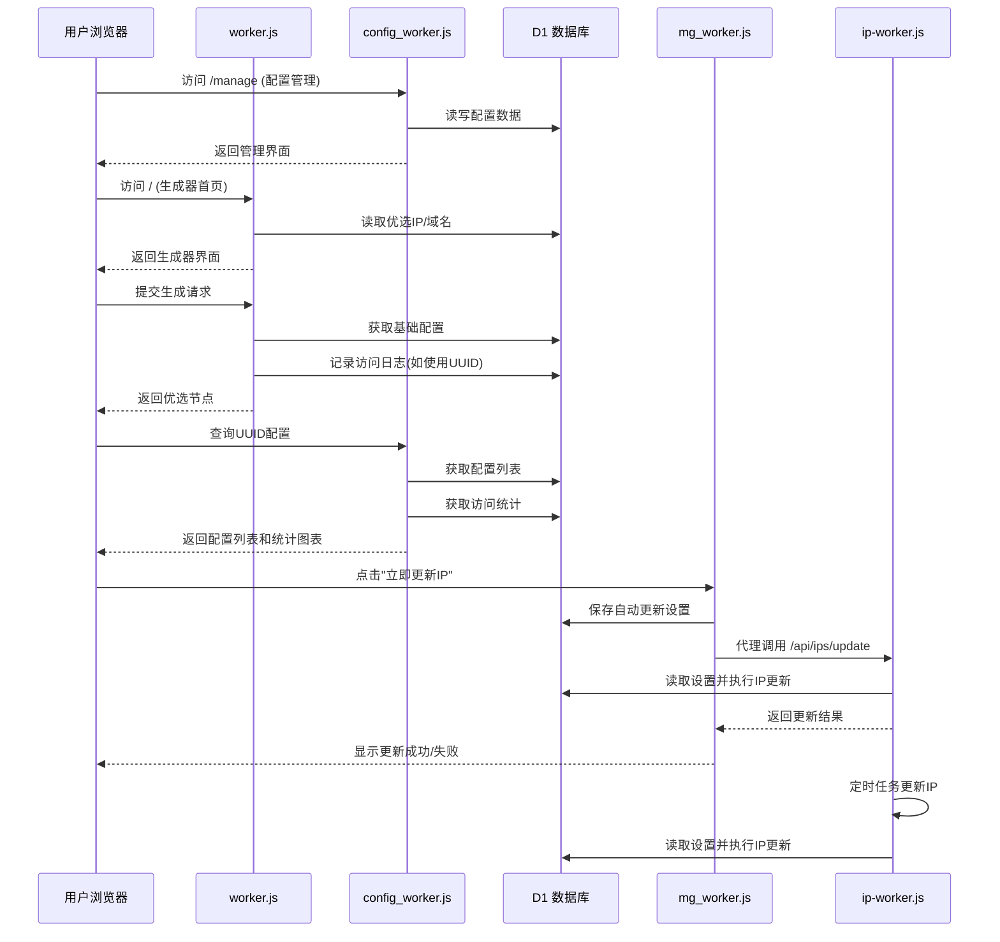

# Cloudflare Worker: 代理配置优选工具

       

这是一个运行在 Cloudflare Worker 上的多功能代理工具，结合 Cloudflare D1 数据库，提供**IP优选**和**域名优选**的批量替换功能。系统采用四 Worker 架构，分别处理优选生成、配置管理、系统管理和IP更新，实现功能解耦和独立部署。

## 📦 系统组成

**系统由4个核心Worker组成**：

- **`worker.js`** - 优选生成器：处理 IP/域名优选、订阅生成、批量配置替换、访问日志记录
- **`config_worker.js`** - 配置管理器：提供配置 CRUD 操作、订阅接口、配置编辑功能、UUID访问统计
- **`mg_worker.js`** - 管理后台：JWT 认证、域名/IP/UUID 管理、系统统计、手动 IP 更新代理、订阅访问统计分析
- **`ip-worker.js`** - IP管理服务：专门处理IP更新任务，支持定时更新和手动更新接口

## ✨ 主要特性

### 1. **四 Worker 微服务架构**

该系统采用四 Worker 架构，各司其职：

*   **`worker.js`** - 优选生成器：处理 IP/域名优选、订阅生成、批量配置替换、访问日志记录
*   **`config_worker.js`** - 配置管理器：提供配置 CRUD 操作、订阅接口、配置编辑功能，包含外部配置生成器链接和UUID访问统计
*   **`mg_worker.js`** - 管理后台：JWT 认证、域名/IP/UUID 管理、系统统计、手动 IP 更新代理、订阅访问统计分析
*   **`ip-worker.js`** - IP管理服务：专门处理IP更新任务，支持定时更新和手动更新接口，与mg_worker.js共享数据库

### 2. **双模式优选**

*   支持将配置中的地址批量替换为 **优选 IP** 或 **优选域名**
*   **支持 IPv4/IPv6** 和不同运营商（电信/联通/移动）筛选
*   **IP 资源池增加了 IP 来源显示**（如：HostMonit IPv4, HostMonit IPv6, Vps789）
*   支持通过管理后台手动更新 IP 数据源（代理到ip-worker.js服务）

### 3. **配置管理 (CRUD) [v1.2]**

*   提供完整的管理界面，可添加、查询、编辑、删除基础配置（支持 VMess, VLESS, Trojan）
*   按 UUID 分组管理，方便生成不同的订阅
*   支持配置编辑功能，可修改别名、地址、端口、传输协议等参数
*   提供配置生成器外部链接（"配置生成"按钮），链接到外部配置生成器（https://cfst.api.yangzifun.org）
*   改进的订阅链接显示方式（使用可复制的输入框）
*   统一的前端按钮样式

### 4. **动态订阅生成**

*   提供 `/sub/{uuid}` 订阅接口，返回 Base64 编码的配置列表
*   支持通过 URL 参数动态指定 IP 类型（IPv4/IPv6）或运营商（电信/联通/移动）
*   支持批量添加配置，提高管理效率

### 5. **访问日志记录 [v2.0新增]**

*   **完整的访问统计**：记录用户通过UUID生成配置的所有访问
*   **双模式记录**：
    - 订阅链接访问 (`subscription`)
    - 网页API生成访问 (`api-generation`)
*   **客户端信息收集**：记录客户端IP、User-Agent
*   **实时统计API**：提供`/stats`接口获取详细的访问统计数据
*   **汇总分析**：支持按日期、UUID、访问类型进行多维度统计

### 6. **订阅分析功能 [v2.0新增]**

*   **管理后台订阅分析**：在管理后台提供全局访问分析
*   **配置页面UUID统计**：在配置管理页面为每个UUID提供专属统计图表
*   **交互式趋势图表**：使用Chart.js可视化近7/14/30/60天的访问趋势
*   **多维度分析**：
    - 总访问量趋势
    - 订阅访问 vs 网页生成访问对比
*   **实时数据更新**：支持手动刷新统计数据
*   **详细访问记录**：显示最近访问记录和客户端信息

### 7. **完整的数据管理**

*   域名管理：添加、编辑、删除优选域名
*   **IP 资源池管理**：查看、删除、刷新优选 IP，**支持 HostMonit IPv6 接口开启/关闭，并显示 IP 来源**
*   UUID 分组管理：按 UUID 管理配置分组
*   系统统计：实时查看域名、IP、UUID 数量统计
*   **IP更新职责分离**：IP更新任务由专门的ip-worker.js处理，管理后台仅作为代理

### 8. **安全特性**

*   JWT 认证系统，保障管理后台安全
*   **MFA双重验证 [v1.4新增]**：
    - 支持TOTP(基于时间的一次性密码)验证
    - 管理员可启用/禁用MFA
    - 提供10个一次性备份码，防止验证器丢失
    - 支持使用备份码登录
*   响应式设计，适配桌面和移动设备
*   配置生成器外部链接跳转功能，提供一站式配置管理体验

## 🛠️ 部署准备

在使用此脚本之前，您需要：

1.  一个 **Cloudflare** 账号。
2.  启用 **Workers** 和 **D1 Database** 功能。
3.  至少一个自定义域名（用于部署四个Worker）。

## 🚀 部署步骤

### 1. 创建 D1 数据库

在 Cloudflare 控制台的 "Workers & Pages" -> "D1" 中创建一个新的数据库（例如命名为 `proxy-db`）。

### 2. 初始化数据库 (SQL)

进入 D1 数据库的 "Console" 标签页，执行以下 SQL 语句以创建所需的表结构：

```sql
/* =================================================================
 *  D1 数据库建表 Schema (v2.1.1更新)
 * ================================================================= */

-- 用户表
CREATE TABLE IF NOT EXISTS admin_users (
    id INTEGER PRIMARY KEY AUTOINCREMENT,
    username TEXT UNIQUE,
    password_hash TEXT,
    mfa_enabled INTEGER DEFAULT 0, -- 增加MFA字段
    mfa_secret TEXT,             -- 增加MFA密钥字段
    last_mfa_login INTEGER DEFAULT 0, -- 增加MFA上次登录时间
    last_backup_login INTEGER DEFAULT 0 -- 增加备份码上次登录时间
);
-- 域名表
CREATE TABLE IF NOT EXISTS cf_domains (
    id INTEGER PRIMARY KEY AUTOINCREMENT,
    domain TEXT UNIQUE,
    remark TEXT,
    created_at INTEGER
);
-- UUID 配置表
CREATE TABLE IF NOT EXISTS configs (
    id INTEGER PRIMARY KEY AUTOINCREMENT,
    uuid TEXT,
    config TEXT, 
    created_at INTEGER
);
-- IP 池表 (v2.1更新：新增source字段)
CREATE TABLE IF NOT EXISTS cfips (
    id INTEGER PRIMARY KEY AUTOINCREMENT,
    ip TEXT UNIQUE,
    ip_type TEXT,
    carrier TEXT,
    source TEXT DEFAULT 'unknown', -- 新增IP来源字段
    created_at INTEGER
);
-- 自动更新设置表 (v1.3新增, v2.1更新：新增hostmonit_v4/hostmonit_v6等)
CREATE TABLE IF NOT EXISTS auto_update_settings (
    source TEXT PRIMARY KEY,
    enabled INTEGER NOT NULL,
    updated_at INTEGER DEFAULT (CAST(STRFTIME('%s', 'now') AS INT) * 1000)
);

-- MFA 备份码表 (v1.4新增)
CREATE TABLE IF NOT EXISTS mfa_backup_codes (
    id INTEGER PRIMARY KEY AUTOINCREMENT,
    username TEXT NOT NULL, -- 更改为username以便直接关联
    code TEXT NOT NULL,
    used INTEGER DEFAULT 0,
    created_at INTEGER DEFAULT (CAST(STRFTIME('%s', 'now') AS INT) * 1000),
    used_at INTEGER DEFAULT 0
);

-- 访问日志表 (v2.0新增)
CREATE TABLE IF NOT EXISTS config_access_logs (
    id INTEGER PRIMARY KEY AUTOINCREMENT,
    uuid TEXT NOT NULL,
    query_type TEXT NOT NULL,  -- 记录类型: 'subscription' 或 'api-generation'
    client_ip TEXT,
    user_agent TEXT,
    created_at TEXT DEFAULT (STRFTIME('%Y-%m-%dT%H:%M:%SZ', 'now'))
);

-- 为访问日志添加索引以优化查询性能
CREATE INDEX IF NOT EXISTS idx_access_logs_uuid ON config_access_logs(uuid);
CREATE INDEX IF NOT EXISTS idx_access_logs_date ON config_access_logs(created_at);
CREATE INDEX IF NOT EXISTS idx_access_logs_type ON config_access_logs(query_type);

-- 初始化管理员 (账号: admin / 密码: password)
-- Hash 值是 "password" 的 SHA-256
INSERT INTO admin_users (username, password_hash, mfa_enabled) VALUES ('admin', '5e884898da28047151d0e56f8dc6292773603d0d6aabbdd62a11ef721d1542d8', 0) ON CONFLICT(username) DO NOTHING;

-- 初始化自动更新设置 (v1.3新增, v2.1更新了来源键名)
INSERT OR IGNORE INTO auto_update_settings (source, enabled) VALUES 
('global_enabled', 1),
('hostmonit_v4', 1),
('hostmonit_v6', 0), -- 默认不开启IPv6
('vps789', 1),
('last_executed', 0); -- 记录上次执行时间戳
```

### 3. 创建四个Worker并绑定D1

创建四个Worker并绑定到同一个D1数据库：

| Worker名称     | 绑定文件           | 数据库绑定变量 | 建议路由/域名               |
| -------------- | ------------------ | -------------- | --------------------------- |
| `proxy-main`   | `worker.js`        | `DB`           | `proxy.example.com/*`       |
| `proxy-config` | `config_worker.js` | `DB`           | `config.example.com/*`      |
| `proxy-mg`     | `mg_worker.js`     | `DB`           | `mg.example.com/*`          |
| `proxy-ip`     | `ip-worker.js`     | `DB`           | `ip-cfst.api.yangzifun.org` |

绑定步骤：

1.  每个Worker的"Settings" → "Variables"中添加D1绑定
2.  **Variable name** 必须设置为 `DB`（区分大小写）
3.  选择前面创建的D1数据库
4.  **路由配置**：
    *   在 DNS 设置中创建四条路由（示例，请替换为您的实际域名）
    *   **注意**：`ip-worker.js` 需要分配一个独立的域名，如 `ip-cfst.api.yangzifun.org`
5.  **重要配置**：进入每个 Worker 的 **Settings** -> **Variables**：
    *   **D1 Database Bindings**：
        *   **Variable name**: `DB` (必须完全一致，注意大写)
        *   **D1 database**: 选择第 1 步创建的数据库。
    *   **JWT 密钥**（仅限 `mg_worker.js`）：
        *   **Variable name**: `JWT_SECRET` (必须完全一致)
        *   **Value**: 请设置一个足够长且复杂的随机字符串作为 JWT 密钥，用于签名和验证管理后台的认证 Token。例如，可以使用 `openssl rand -base64 32` 生成。
    *   **IP Worker 域名**（仅限 `mg_worker.js`）：
        *   **Variable name**: `IP_WORKER_DOMAIN` (可选，可在代码中直接设置)
        *   **Value**: 设置为 `ip-worker.js` 的域名，如 `https://ip-cfst.api.yangzifun.org`

### 4. 初始化域名表 (可选)

在配置管理页(`mg.example.com`)上线后，您可以直接在UI中添加域名：

1.  访问管理后台地址 (`mg.example.com`) 并登录。
2.  切换到 "优选域名" 标签页。
3.  点击 "添加域名" 按钮。
4.  输入域名和备注信息。

或者通过 SQL 初始化（在 D1 Console 中执行）：

```sql
INSERT INTO cf_domains (domain, remark, created_at) VALUES 
('cf.example.com', '默认优选域名', unixepoch()),
('cdn.example.net', '加速CDN专用', unixepoch());
```

### 5. 部署上线

点击 "Deploy" 保存并发布所有Worker。访问各 Worker 的 URL 即可看到操作界面。

---

## 📖 使用指南

### 1. 首页 (批量生成器)

*   **基础配置**：
    *   **手动粘贴**：直接将 vmess/vless 链接粘贴到文本框。
    *   **从 UUID 获取**：输入在管理页保存的 UUID，脚本会自动拉取该组所有配置。
*   **优选列表**：
    *   **IP 地址**：选择 IPv4/IPv6 或特定运营商。支持 HostMonit IPv4/IPv6 及 Vps789 等多个来源的 IP 数据。如果 IP 池为空，请在管理后台的 **"IP 资源池管理"** 中，点击 **"立即更新"** 按钮手动获取 IP。
    *   **优选域名**：直接使用数据库 `cf_domains` 表中的域名。
*   **生成配置**：点击按钮，底部文本框将显示替换后的节点列表。
*   **访问日志**：使用UUID生成配置会自动记录访问日志，用于后台统计。

### 2. 配置管理页 (`config.example.com`)

*   在此页面，您可以：
    *   **管理基础配置**：添加/查询/删除节点配置
    *   **查看 UUID 统计**：为当前查询的 UUID 显示访问统计图表
    *   **添加新配置**：批量添加新的配置节点
*   **操作指南**：
    1.  在"检索订阅"卡片：
        -   **输入UUID**：输入要查询的UUID
        -   **点击查询**：查看该UUID下的所有配置
    2.  在"配置列表"卡片：
        -   **编辑配置**：点击编辑按钮修改配置参数
        -   **删除配置**：删除单个配置或整个UUID组
    3.  在"访问统计"卡片：
        -   **查看趋势图**：选择时间范围（7/14/30/60天）查看访问趋势
        -   **切换图表类型**：查看总访问量或分类统计
        -   **查看访问记录**：查看最近的访问记录和客户端信息
    4.  在"添加新节点"卡片：
        -   **批量添加配置**：支持vmess/vless/trojan链接批量添加

### 3. 管理后台 (`mg.example.com`)

*   首次访问 `mg.example.com` 会跳转到 `/login` 页面。
*   默认管理员账号：`admin`，密码：`password`。登录后请务必修改密码。
*   在此页面，您可以：
    *   **系统概览**：查看系统状态和访问摘要
    *   **域名管理**：添加/编辑/删除优选域名
    *   **IP 资源池管理**：**管理 IP 池，包括新的 HostMonit IPv6 开启按钮，并显示 IP 来源**，以及自动更新设置。点击"立即更新"会通过代理调用ip-worker.js服务
    *   **配置分组管理**：查看和管理 UUID 分组
    *   **订阅分析**：全局访问统计分析
    *   **安全中心**：管理 MFA 双重验证

### 4. 订阅链接

生成配置后，如果使用了 UUID 模式，系统会提供一个永久订阅链接，格式如下：

*   **IP 模式**: `proxy.example.com/batch-configs/{uuid}?type=ip&ipType=v4&carrier=CT`
*   **域名 模式**: `proxy.example.com/batch-configs/{uuid}?type=domain`

---

## ⚙️ 系统架构

### 组件交互流程



### 接口调用关系

| 调用方         | 被调用方           | 接口路径                            | 数据流向             |
| :------------- | :----------------- | :---------------------------------- | :------------------- |
| `worker.js`    | `config_worker.js` | `/api/configs/:uuid`                | 拉取基础配置         |
| `worker.js`    | `mg_worker.js`     | `/api/ips`                          | 获取优选IP           |
| `worker.js`    | `mg_worker.js`     | `/api/domains`                      | 获取优选域名         |
| `worker.js`    | `config_worker.js` | `/api/access_log`                   | 记录访问日志         |
| 用户浏览器     | `mg_worker.js`     | `/api/login` (及其他`/api`前缀接口) | 管理后台操作         |
| 用户浏览器     | `mg_worker.js`     | `/api/ips/refresh`                  | 手动更新IP（代理）   |
| 用户浏览器     | `mg_worker.js`     | `/api/stats`                        | 全局订阅统计分析     |
| 用户浏览器     | `config_worker.js` | `/api/stats/uuid/:uuid`             | 查询特定UUID访问统计 |
| `mg_worker.js` | `ip-worker.js`     | `/api/ips/update`                   | 执行IP更新任务       |

## 📡 API 接口文档

### mg_worker.js 接口：

| 方法     | 路径                        | 描述                       | 参数示例                                                     |
| :------- | :-------------------------- | :------------------------- | :----------------------------------------------------------- |
| `GET`    | `/`                         | 管理后台首页UI             | -                                                            |
| `POST`   | `/api/login`                | 管理员登录                 | JSON body                                                    |
| `GET`    | `/api/domains`              | 获取域名列表               | `?page=1&size=10&sort=domain&order=asc`                      |
| `POST`   | `/api/domains`              | 添加域名                   | `{"domain":"new.site.com", "remark":"新域名"}`               |
| `PUT`    | `/api/domains`              | 更新域名                   | `{"id":1, "domain":"updated.com", "remark":"更新"}`          |
| `DELETE` | `/api/domains`              | 删除域名                   | `{"id":1}`                                                   |
| `GET`    | `/api/ips`                  | 获取IP列表                 | `?page=1&size=20&sort=ip&order=desc`                         |
| `POST`   | `/api/ips/refresh`          | **代理调用IP更新**         | `{"global_enabled":true, "hostmonit_v4":true, "hostmonit_v6":false, "vps789":true}` |
| `DELETE` | `/api/ips`                  | 删除IP                     | `{"ip":"1.1.1.1"}`                                           |
| `GET`    | `/api/uuids`                | 获取UUID列表               | `?page=1&size=10&sort=updated_at&order=desc`                 |
| `DELETE` | `/api/uuids`                | 删除UUID分组及其所有配置   | `{"uuid":"some_uuid"}`                                       |
| `GET`    | `/api/settings/auto-update` | 获取自动更新设置           | -                                                            |
| `POST`   | `/api/settings/auto-update` | 更新自动更新设置           | `{"global_enabled": true, "hostmonit_v4": true, "hostmonit_v6": false, "vps789": true}` |
| `GET`    | `/api/stats`                | 获取系统概览及全局访问统计 | `?days=30` (默认30天)                                        |
| `GET`    | `/api/stats/uuid-details`   | 获取指定UUID的详细访问记录 | `?uuid={uuid}&start_date=xxx&end_date=xxx`                   |

### ip-worker.js 接口：

| 方法   | 路径                | 描述                           | 参数示例                                                     |
| :----- | :------------------ | :----------------------------- | :----------------------------------------------------------- |
| `GET`  | `/`                 | 服务状态页面                   | -                                                            |
| `GET`  | `/api/ips/list`     | 获取IP列表（公开接口）         | `?page=1&size=20&sort=created_at&order=desc`                 |
| `GET`  | `/api/ips/update`   | **手动触发IP更新（无需认证）** | -                                                            |
| `POST` | `/api/ips/settings` | 设置自动更新配置（需认证）     | `{"global_enabled": true, "hostmonit_v4": true, "hostmonit_v6": false, "vps789": true}` |

### config_worker.js 接口 (v2.0+)：

| 方法     | 路径                    | 描述             | 参数示例                                                |
| :------- | :---------------------- | :--------------- | :------------------------------------------------------ |
| `GET`    | `/api/configs/:uuid`    | 获取UUID配置列表 | -                                                       |
| `POST`   | `/api/configs`          | 批量添加配置     | JSON body (vmess/vless/trojan链接列表)                  |
| `PUT`    | `/api/configs`          | 更新单个配置     | `{"id":123, "config":"vmess://..."}` (仅更新config字段) |
| `DELETE` | `/api/configs`          | 删除指定UUID组   | `{"uuid":"some_uuid"}`                                  |
| `DELETE` | `/api/configs/id/:id`   | 删除单个配置     | -                                                       |
| `GET`    | `/api/stats/uuid/:uuid` | 获取UUID访问统计 | `?days=30` (默认30天)                                   |
| `POST`   | `/api/access_log`       | 记录访问日志     | `{"uuid":"...", "query_type":"subscription", ...}`      |

### 统计接口说明

#### 1. 获取UUID访问统计 (`GET /api/stats/uuid/:uuid` by `config_worker.js`)

返回指定UUID的详细访问统计信息，支持时间范围参数：

- **days**: 查询天数（7/14/30/60天），例如 `?days=14`

响应格式示例：

```json
{
  "success": true,
  "uuid": "my-uuid-123",
  "total_access": 150,
  "subscription_count": 120,
  "apigen_count": 30,
  "first_access": 1705307400000, // Unix timestamp (ms)
  "last_access": 1705742700000,   // Unix timestamp (ms)
  "today_total": 15,
  "today_subscription": 12,
  "today_apigen": 3,
  "daily_stats": [
    {
      "date": "2024-01-20",
      "total": 25,
      "subscription": 20,
      "api_generation": 5
    }
  ],
  "recent_logs": [
    {
      "uuid": "my-uuid-123",
      "query_type": "subscription",
      "client_ip": "123.123.123.123",
      "user_agent": "Clash/2.0",
      "created_at": 1705742700000 // Unix timestamp (ms)
    }
  ]
}
```

#### 2. 获取系统统计 (`GET /api/stats` by `mg_worker.js`)

返回完整的系统统计信息，包括：

-   **基础统计**: 域名数、IP数、UUID分组数、自动更新状态
-   **访问统计**: 总访问次数、今日访问、订阅访问、网页生成访问
-   **趋势数据**: 近N天的每日访问数据
-   **热门UUID**: 访问次数最多的UUID排行

响应格式示例：

```json
{
  "domains": 15,
  "ips": 256,
  "uuids": 8,
  "autoUpdate": 1, // 0表示关闭，1表示开启
  "lastExecuted": 1707907200000, // Unix timestamp (ms)
  "access_stats": {
    "success": true,
    "total_requests": 150,
    "unique_uuids": 8,
    "subscription_requests": 120,
    "api_generation_requests": 30,
    "today_total": 15,
    "today_subscription": 12,
    "today_apigen": 3,
    "daily_stats": [
       {"date": "2024-02-14", "total": 10, "subscription": 8, "api_generation": 2, "unique_uuids": 5}
    ],
    "popular_uuids": [
       {"uuid": "uuid-abc", "access_count": 50, "subscription_count": 40, "apigen_count": 10}
    ]
  }
}
```

#### 3. 获取UUID详细访问记录 (`GET /api/stats/uuid-details` by `mg_worker.js`)

返回指定UUID的详细访问记录，支持时间范围筛选。

-   **uuid**: 必填，要查询的 UUID
-   **start_date**: 可选，起始日期，格式 `YYYY-MM-DD`
-   **end_date**: 可选，结束日期，格式 `YYYY-MM-DD`

响应格式示例：

```json
{
  "success": true,
  "uuid": "my-config-group",
  "total_access": 45,
  "first_access": 1705307400000, // Unix timestamp (ms)
  "last_access": 1705742700000,   // Unix timestamp (ms)
  "access_logs": [
    {
      "uuid": "my-config-group",
      "query_type": "subscription",
      "client_ip": "123.123.123.123",
      "user_agent": "Clash/2.0",
      "created_at": 1705742700000 // Unix timestamp (ms)
    },
    // ...更多记录
  ]
}
```

### MFA相关接口：

| 方法   | 路径                               | 描述                        |
| ------ | ---------------------------------- | --------------------------- |
| `POST` | `/api/mfa/init`                    | 初始化MFA，获取密钥和二维码 |
| `POST` | `/api/mfa/verify-first`            | 首次验证MFA并启用           |
| `POST` | `/api/mfa/login-with-backup`       | 使用备份码登录              |
| `GET`  | `/api/mfa/status`                  | 获取MFA状态                 |
| `POST` | `/api/mfa/disable`                 | 禁用MFA                     |
| `POST` | `/api/mfa/backup-codes/regenerate` | 重新生成备份码              |

### 自动更新设置接口说明

-   **获取自动更新设置** (`GET /api/settings/auto-update`): 
    返回当前自动更新配置，包括每个数据源 (`global_enabled`, `hostmonit_v4`, `hostmonit_v6`, `vps789`) 的启用状态，以及 `last_executed` 时间戳。

-   **更新自动更新设置** (`POST /api/settings/auto-update`): 
    更新自动更新配置。请求体为JSON格式，示例：

    ```json
    { 
      "global_enabled": true, 
      "hostmonit_v4": true,
      "hostmonit_v6": false, 
      "vps789": true 
    }
    ```

---

## ⚠️ 注意事项

1.  **文件分工**：
    *   `worker.js` 处理优选逻辑和订阅生成，新增访问日志记录功能
    *   `config_worker.js` 专注配置管理 CRUD 操作和UUID统计
    *   `mg_worker.js` 处理系统管理、JWT认证和统计分析
    *   `ip-worker.js` 专门处理IP更新任务，支持定时和手动更新

2.  **IP 更新 [v2.1.1更新]**：
    *   IP更新功能已从`mg_worker.js`分离到独立的`ip-worker.js`
    *   管理后台的"立即更新"按钮会调用`mg_worker.js`的代理接口，然后由`mg_worker.js`调用`ip-worker.js`执行实际更新
    *   `ip-worker.js`支持定时自动更新和手动触发更新
    *   支持全局开关和按接口源（**HostMonit IPv4**、**HostMonit IPv6**、**Vps789**）单独配置。
    *   **IP 池中的 IP 数据现在会记录其原始来源**（例如 `hostmonit_v4`、`hostmonit_v6`、`vps789`）。
    *   **IPv6 地址在存储时不再额外添加 `[]` 符号。**
    *   确保`ip-worker.js`部署在独立的域名上，并在`mg_worker.js`中正确配置`IP_WORKER_DOMAIN`

3.  **域名管理**：
    *   通过 SQL 命令维护 `cf_domains` 表：`INSERT INTO cf_domains (domain, remark) VALUES ('example.com', '优质域名')`
    *   支持在管理后台(`mg.example.com`)直接管理域名（v1.2+新功能）

4.  **访问日志与统计**：
    *   仅记录通过UUID生成配置的访问，手动粘贴配置不记录
    *   访问日志异步记录，不影响主业务流程
    *   包含客户端IP和User-Agent信息，可用于安全分析
    *   统计分析数据基于访问日志表，支持多维度查询
    *   需要在`config_access_logs`表中创建索引以优化查询性能

5.  **VMess 格式**：代码仅支持标准的 JSON 格式 Base64 编码的 VMess 链接。

6.  **配置同步**：通过 `config_worker.js` 管理的配置会实时同步到 D1 数据库。

7.  **图表依赖**：订阅分析功能使用Chart.js库，需要联网加载CDN资源。

8.  **共享数据库**：四个Worker使用同一个D1数据库，确保数据一致性。

## 📊 版本更新历史

### v2.1.1 (最新)

-   **IP更新功能分离**：将IP更新功能从`mg_worker.js`分离到独立的`ip-worker.js`
-   **四Worker架构**：系统现在由四个Worker组成，职责更清晰
-   **代理调用机制**：管理后台"立即更新"按钮通过代理调用ip-worker.js服务
-   **保持向后兼容**：所有接口保持不变，仅内部实现调整

### v2.1

-   **支持 IPv6 地址获取与管理**：新增 HostMonit IPv6 接口，可在管理后台启用。
-   **IP 来源追踪**：`cfips` 表新增 `source` 字段，记录每个 IP 的具体来源（HostMonit IPv4/IPv6, Vps789）。
-   **管理后台界面优化**：
    *   IP 资源池管理界面增加 HostMonit IPv6 开关按钮。
    *   IP 列表表格新增"来源"列，直观显示 IP 来源。
    *   IP 地址存储不再包含 `[]`，保持纯净格式。
-   **自动更新设置增强**：管理后台的自动更新设置支持对 IPv4 和 IPv6 来源分别配置。

### v2.0

-   **增强配置管理器**：为每个UUID提供专属访问统计图表
-   **新增实时趋势分析**：在配置管理页面展示访问趋势折线图
-   **增加访问记录功能**：显示最近访问记录和客户端信息
-   **优化用户体验**：更直观的数据展示和交互式图表
-   **扩展统计接口**：提供更灵活的统计查询选项
-   **日志记录**：新增访问日志记录功能

### v1.4

-   新增MFA双重验证功能
-   支持TOTP验证和备份码登录
-   增强系统安全性

### v1.3

-   新增自动更新IP池功能
-   支持多个IP数据源配置
-   添加自动更新管理界面

### v1.2

-   新增配置管理页面
-   支持配置CRUD操作
-   添加域名管理功能
-   改进订阅链接显示

### v1.1

-   初始稳定版本
-   支持IP/域名优选替换
-   提供订阅接口
-   基础管理功能

## 🎯 适用场景

1.  **代理配置批量管理**：适合管理多个代理配置，避免重复修改
2.  **IP优选服务**：为代理提供优化的Cloudflare IP和域名
3.  **订阅服务分发**：通过UUID分组为不同用户提供定制订阅
4.  **使用情况分析**：通过统计分析了解配置的使用情况和热度
5.  **多管理员协作**：支持多管理员通过JWT认证管理配置

## 🔧 技术栈

-   **运行环境**: Cloudflare Workers (无服务器边缘计算)
-   **数据库**: Cloudflare D1 (基于SQLite的分布式数据库)
-   **前端框架**: 纯HTML/CSS/JavaScript，无框架依赖
-   **图表库**: Chart.js (用于数据可视化)
-   **认证系统**: JWT + TOTP双重验证
-   **通讯协议**: 支持VMess、VLESS、Trojan协议

---

**免责声明**：本工具仅供学习和研究使用，请遵守当地法律法规，不得用于非法用途。作者不承担任何使用本工具产生的法律责任。