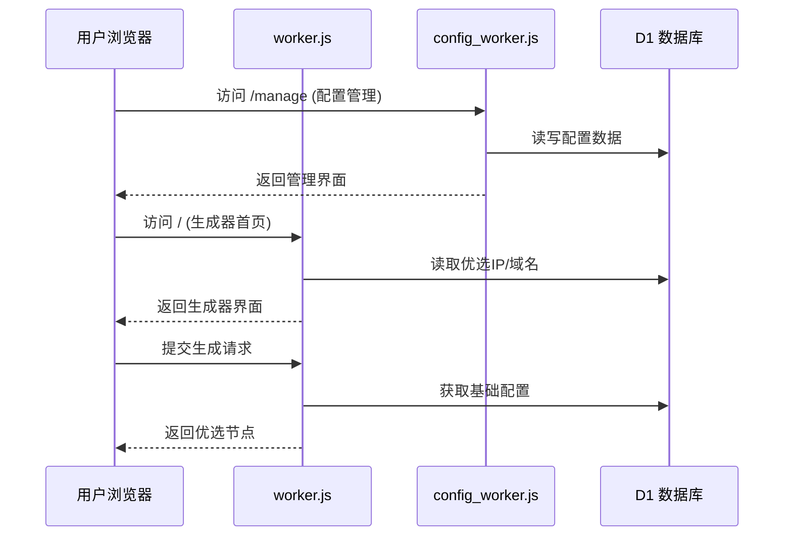

# Cloudflare Worker: 代理配置优选工具 (All-in-One Proxy Tool)

这是一个运行在 Cloudflare Worker 上的多功能代理工具，结合 Cloudflare D1 数据库，提供**IP优选**和**域名优选**的批量替换功能。它集成了现代化的前端 UI，支持基础配置管理、自动获取优选 IP 以及生成包含优选地址的订阅链接。

## ✨ 主要特性

1.  **双 Worker 架构**：
    ```mermaid
    graph LR
    A[用户浏览器] --> B(worker.js)
    A --> C(config_worker.js)
    B --> D[(Cloudflare D1)]
    C --> D
    ```
    *   `worker.js` - 主业务逻辑/订阅生成
    *   `config_worker.js` - 专用配置管理接口
    *   通过共享 D1 数据库实现数据同步
2.  **双模式优选**：支持将配置中的地址批量替换为 **优选 IP** 或 **优选域名**。
3.  **自动化 IP 更新**：
    *   集成 `hostmonit.com` 和 `vps789.com` API。
    *   支持通过 Cron 定时任务自动拉取并缓存最新优选 IP 到 D1 数据库。
3.  **配置管理 (CRUD)**：
    *   提供 `/manage` 界面，可添加、查询、删除基础配置（支持 VMess, VLESS, Trojan）。
    *   按 UUID 分组管理，方便生成不同的订阅。
4.  **动态订阅生成**：
    *   提供类似于 `/batch-configs/{uuid}` 的订阅接口。
    *   支持通过 URL 参数动态指定 IP 类型（IPv4/IPv6）或运营商（电信/联通/移动）。
5.  **现代化 UI**：
    *   内置两个独立的 HTML 页面（生成器首页与管理页）。
    *   适配移动端，包含 Toast 提示和加载动画。

## 🛠️ 部署准备

在使用此脚本之前，您需要：
1.  一个 **Cloudflare** 账号。
2.  启用 **Workers** 和 **D1 Database** 功能。

## 🚀 部署步骤

### 1. 创建 D1 数据库

在 Cloudflare 控制台的 "Workers & Pages" -> "D1" 中创建一个新的数据库（例如命名为 `proxy-db`）。

### 2. 初始化数据库 (SQL)

进入 D1 数据库的 "Console" 标签页，执行以下 SQL 语句以创建所需的表结构：

```sql
/* =================================================================
 *  D1 数据库建表 Schema
 * ================================================================= */

-- 1. configs 表：存储用户管理的基础配置 (VMess/VLESS/Trojan)
CREATE TABLE IF NOT EXISTS configs (
    id INTEGER PRIMARY KEY AUTOINCREMENT,
    uuid TEXT NOT NULL,
    config_data TEXT NOT NULL,
    protocol TEXT,
    remark TEXT,
    created_at INTEGER,
    updated_at INTEGER,
    UNIQUE (uuid, config_data)
);

-- 2. cfips 表：存储从 API 抓取并缓存的 Cloudflare 优选 IP
CREATE TABLE IF NOT EXISTS cfips (
    ip TEXT PRIMARY KEY,
    ip_type TEXT NOT NULL, -- 'v4' or 'v6'
    carrier TEXT NOT NULL, -- 'CM', 'CU', 'CT', 'ALL'
    created_at INTEGER NOT NULL
);

-- 3. cf_domains 表：存储优选域名列表
CREATE TABLE IF NOT EXISTS cf_domains (
    id INTEGER PRIMARY KEY AUTOINCREMENT,
    domain TEXT UNIQUE NOT NULL,
    remark TEXT,
    created_at INTEGER
);

-- (可选) 初始化插入一些示例优选域名
-- 请替换为您自己收集的高质量优选域名
INSERT INTO cf_domains (domain, remark, created_at) VALUES 
('www.visa.com.sg', '示例域名1', 1716300000),
('www.csgo.com', '示例域名2', 1716300000),
('time.is', '示例域名3', 1716300000);
```

### 3. 创建双 Worker 并绑定 D1

1.  **创建主 Worker**：
    *   新建 Standard Worker 命名为 `proxy-main`
    *   将 `worker.js` 代码复制到编辑器
    *   绑定 D1 数据库：变量名 `DB` → 选择创建的数据库

2.  **创建配置管理 Worker**：
    *   新建 Standard Worker 命名为 `proxy-config`
    *   将 `config_worker.js` 代码复制到编辑器
    *   绑定 **同一个** D1 数据库：变量名 `DB`

3.  **路由配置**：
    *   在 DNS 设置中创建两条路由：
    ```
    proxy.example.com/* → proxy-main
    config.example.com/* → proxy-config
    ```
3.  **重要配置**：进入 Worker 的 **Settings** -> **Variables**：
    *   **D1 Database Bindings**：
    *   **Variable name**: `DB` (必须完全一致，注意大写)
    *   **D1 database**: 选择第 1 步创建的数据库。

### 4. 初始化域名表 (可选)
在配置管理页(`/manage`)上线后，您可以直接在UI中添加域名：
1. 访问Worker地址 + `/manage`
2. 切换到"域名管理"标签页
3. 点击"添加域名"按钮
4. 输入域名和备注信息

或者通过SQL初始化：
```sql
INSERT INTO cf_domains (domain, remark) VALUES 
('example.com', '优质域名'),
('cdn.example.net', 'CDN加速域名');
```

### 5. 设置定时任务 (Cron Triggers)

为了让 Worker 自动从外部接口更新优选 IP 数据，请配置 Cron 触发器：

1.  进入 Worker 的 **Settings** -> **Triggers**。
2.  点击 **Add Cron Trigger**。
3.  设置频率，例如每 4 小时一次：`0 */4 * * *`。
    *   *注意：代码中的 `scheduled` 事件会处理 IP 更新逻辑。*

### 5. 部署上线

点击 "Deploy" 保存并发布 Worker。访问 Worker 的 URL 即可看到操作界面。

---

## 📖 使用指南

### 1. 首页 (批量生成器)
*   **基础配置**：
    *   **手动粘贴**：直接将 vmess/vless 链接粘贴到文本框。
    *   **从 UUID 获取**：输入在管理页保存的 UUID，脚本会自动拉取该组所有配置。
*   **优选列表**：
    *   **IP 地址**：选择 IPv4/IPv6 或特定运营商。建议先点击“从远程 API 更新”以填充数据库。
    *   **优选域名**：直接使用数据库 `cf_domains` 表中的域名。
*   **生成配置**：点击按钮，底部文本框将显示替换后的节点列表。

### 2. 配置管理页 (`/manage`)
*   在此页面，您可以：
    *   **管理基础配置**：添加/查询/删除节点配置
    *   **管理优选域名**：添加/编辑/删除优选域名（v1.2+）
*   **操作指南**：
    1. 在"配置管理"标签页：
        - **添加配置**：输入UUID和VMess/VLESS链接
        - **查询配置**：按UUID筛选配置
        - **删除配置**：点击配置项右侧删除按钮
    2. 在"域名管理"标签页：
        - **添加域名**：输入域名和备注信息
        - **编辑域名**：点击域名项修改信息
        - **删除域名**：点击域名项右侧删除按钮

### 3. 订阅链接
生成配置后，如果使用了 UUID 模式，系统会提供一个永久订阅链接，格式如下：
*   **IP 模式**: `/batch-configs/{uuid}?type=ip&ipType=v4&carrier=CT`
*   **域名 模式**: `/batch-configs/{uuid}?type=domain`

---

## ⚙️ 系统架构

### 组件交互流程


### 接口调用关系
| 调用方        | 被调用方       | 接口路径           | 数据流向         |
|---------------|----------------|--------------------|------------------|
| `worker.js`   | `config_worker.js` | `/config`        | 拉取基础配置     |
| `worker.js`   | `config_worker.js` | `/domain`        | 获取优选域名     |
| 前端页面      | `config_worker.js` | `/manage` 相关接口 | 配置管理操作     |
| 定时任务      | `worker.js`       | `/fetch-ips`     | 触发IP更新       |

## 📡 API 接口文档

### worker.js 接口：
| 方法   | 路径                   | 描述                     |
| :----- | :--------------------- | :----------------------- |
| `GET`  | `/`                    | 优选生成器 UI            |
| `GET`  | `/batch-ip`            | 获取纯文本 IP/域名列表   |
| `GET`  | `/batch-configs/:uuid` | 获取 Base64 订阅配置     |
| `GET`  | `/fetch-addresses`     | (JSON) 获取地址列表数据  |
| `GET`  | `/fetch-ips`           | (旧版兼容) 触发 API 更新 |
| `POST` | `/generate`            | 核心生成接口             |
| `GET`  | `/healthcheck`         | 服务健康检查             |

### config_worker.js 接口：
| 方法   | 路径          | 描述               |
| :----- | :------------ | :----------------- |
| `GET`  | `/manage`     | 配置管理器 UI      |
| `POST` | `/config`     | 添加/更新配置      |
| `GET`  | `/config`     | 查询配置           |
| `DELETE`| `/config`    | 删除配置           |
| `POST` | `/domain`     | 添加/更新域名      |
| `GET`  | `/domain`     | 查询域名列表       |
| `DELETE`| `/domain/:id`| 删除域名           |

| 方法   | 路径                   | 描述                     | 参数示例                                                    |
| :----- | :--------------------- | :----------------------- | :---------------------------------------------------------- |
| `GET`  | `/`                    | 优选生成器 UI            | -                                                           |
| `GET`  | `/manage`              | 配置管理器 UI            | -                                                           |
| `GET`  | `/batch-ip`            | 获取纯文本 IP/域名列表   | `?type=ip` 或 `?type=domain`<br>`?ipType=v4&carrier=CM`     |
| `GET`  | `/batch-configs/:uuid` | 获取 Base64 订阅配置     | `?type=domain` (使用域名)<br>`?type=ip&carrier=CU` (使用IP) |
| `GET`  | `/fetch-addresses`     | (JSON) 获取地址列表数据  | `?type=domain`                                              |
| `GET`  | `/fetch-ips`           | (旧版兼容) 触发 API 更新 | `?source=api` (强制触发更新)                                |
| `POST` | `/generate`            | 核心生成接口             | Body: `{ baseConfig: "...", addressList: "..." }`           |
| `GET`  | `/healthcheck`         | 服务健康检查             | -                                                           |

---

## ⚠️ 注意事项

1.  **文件分工**：
    *   `worker.js` 处理优选逻辑和订阅生成
    *   `config_worker.js` 专注配置管理 CRUD 操作
2.  **首次使用**：数据库中的 IP 表默认为空。请在首页选择“IP 获取来源 -> 从接口更新”，点击“获取优选 IP”按钮，或者等待第一次 Cron 任务执行，数据库才会有数据。
3.  **域名管理**：
    *   通过 SQL 命令维护 `cf_domains` 表：`INSERT INTO cf_domains (domain, remark) VALUES ('example.com', '优质域名')`
    *   支持在配置管理页(`/manage`)直接管理域名（v1.2+新功能）
4.  **VMess 格式**：代码仅支持标准的 JSON 格式 Base64 编码的 VMess 链接。
5.  **配置同步**：通过 `config_worker.js` 管理的配置会实时同步到 D1 数据库。
6.  **版本更新**：最新变更请查看 [更新日志](#更新日志)

## 📌 更新日志

### v1.2 (2025-12-22)
- 新增：配置管理页支持域名CRUD操作
- 优化：IP更新API响应超时处理
- 修复：移动端UI适配问题

### v1.1 (2025-12-15)
- 新增：IPv6优选支持
- 新增：运营商级IP筛选(电信/联通/移动)
