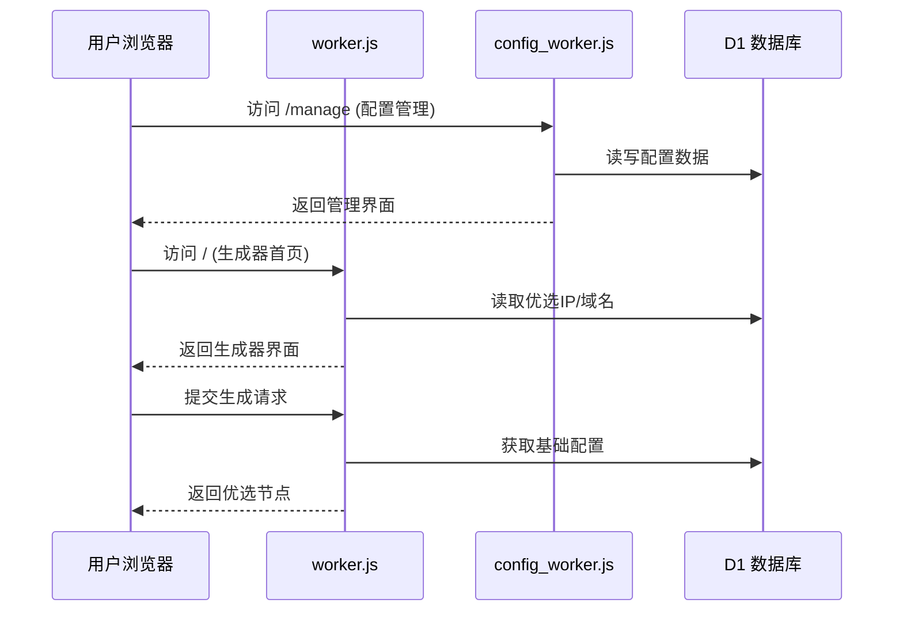

# Cloudflare Worker: 代理配置优选工具

这是一个运行在 Cloudflare Worker 上的多功能代理工具，结合 Cloudflare D1 数据库，提供**IP优选**和**域名优选**的批量替换功能。系统由3个文件组成：**worker.js** - 优选生成器、**config_worker.js** - 配置管理器、**mg_worker.js** - 管理后台。采用三 Worker 架构，分别处理优选生成、配置管理和系统管理，实现功能解耦和独立部署。

## 📦 系统组成

**系统由3个核心文件组成**：
- **`worker.js`** - 优选生成器：处理 IP/域名优选、订阅生成、批量配置替换
- **`config_worker.js`** - 配置管理器：提供配置 CRUD 操作、订阅接口、配置编辑功能
- **`mg_worker.js`** - 管理后台：JWT 认证、域名/IP/UUID 管理、系统统计、手动 IP 更新

## ✨ 主要特性

### 1. **三 Worker 架构**
该系统由3个文件组成：**worker.js** - 优选生成器、**config_worker.js** - 配置管理器、**mg_worker.js** - 管理后台。

   *   **worker.js** - 优选生成器：处理 IP/域名优选、订阅生成、批量配置替换
   *   **config_worker.js** - 配置管理器：提供配置 CRUD 操作、订阅接口、配置编辑功能，包含外部配置生成器链接
   *   **mg_worker.js** - 管理后台：JWT 认证、域名/IP/UUID 管理、系统统计、手动 IP 更新

### 2. **双模式优选**
   *   支持将配置中的地址批量替换为 **优选 IP** 或 **优选域名**
   *   支持 IPv4/IPv6 和不同运营商（电信/联通/移动）筛选
   *   支持通过管理后台手动更新 IP 数据源

### 4. **配置管理 (CRUD) [v1.2]**
   *   提供完整的管理界面，可添加、查询、编辑、删除基础配置（支持 VMess, VLESS, Trojan）
   *   按 UUID 分组管理，方便生成不同的订阅
   *   支持配置编辑功能，可修改别名、地址、端口、传输协议等参数
   *   提供配置生成器外部链接（"配置生成"按钮），链接到外部配置生成器（https://cfst.api.yangzifun.org）
   *   改进的订阅链接显示方式（使用可复制的输入框）
   *   统一的前端按钮样式

### 5. **动态订阅生成**
   *   提供 `/sub/{uuid}` 订阅接口，返回 Base64 编码的配置列表
   *   支持通过 URL 参数动态指定 IP 类型（IPv4/IPv6）或运营商（电信/联通/移动）
   *   支持批量添加配置，提高管理效率

### 6. **完整的数据管理**
   *   域名管理：添加、编辑、删除优选域名
   *   IP 资源池管理：查看、删除、刷新优选 IP
   *   UUID 分组管理：按 UUID 管理配置分组
   *   系统统计：实时查看域名、IP、UUID 数量统计

### 7. **安全特性**
   *   JWT 认证系统，保障管理后台安全
   *   响应式设计，适配桌面和移动设备
   *   配置生成器外部链接跳转功能，提供一站式配置管理体验

## 🛠️ 部署准备

在使用此脚本之前，您需要：
1.  一个 **Cloudflare** 账号。
2.  启用 **Workers** 和 **D1 Database** 功能。

## 🚀 部署步骤

### 1. 创建 D1 数据库

在 Cloudflare 控制台的 "Workers & Pages" -> "D1" 中创建一个新的数据库（例如命名为 `proxy-db`）。

### 2. 初始化数据库 (SQL)

进入 D1 数据库的 "Console" 标签页，执行以下 SQL 语句以创建所需的表结构：

```sql
/* =================================================================
 *  D1 数据库建表 Schema
 * ================================================================= */

-- 用户表
CREATE TABLE IF NOT EXISTS admin_users (
    id INTEGER PRIMARY KEY AUTOINCREMENT,
    username TEXT UNIQUE,
    password_hash TEXT
);
-- 域名表
CREATE TABLE IF NOT EXISTS cf_domains (
    id INTEGER PRIMARY KEY AUTOINCREMENT,
    domain TEXT UNIQUE,
    remark TEXT,
    created_at INTEGER
);
-- UUID 配置表
CREATE TABLE IF NOT EXISTS configs (
    id INTEGER PRIMARY KEY AUTOINCREMENT,
    uuid TEXT,
    config TEXT, 
    created_at INTEGER
);
-- IP 池表
CREATE TABLE IF NOT EXISTS cfips (
    id INTEGER PRIMARY KEY AUTOINCREMENT,
    ip TEXT UNIQUE,
    ip_type TEXT,
    carrier TEXT,
    created_at INTEGER
);
-- 自动更新设置表 (v1.3新增)
CREATE TABLE IF NOT EXISTS auto_update_settings (
    id INTEGER PRIMARY KEY AUTOINCREMENT,
    source TEXT UNIQUE NOT NULL,
    enabled INTEGER DEFAULT 1,
    updated_at INTEGER DEFAULT (unixepoch())
);

-- 初始化管理员 (账号: admin / 密码: password)
-- Hash 值是 "password" 的 SHA-256
INSERT INTO admin_users (username, password_hash) VALUES ('admin', '5e884898da28047151d0e56f8dc6292773603d0d6aabbdd62a11ef721d1542d8');

-- 初始化自动更新设置 (v1.3新增)
INSERT OR IGNORE INTO auto_update_settings (source, enabled) VALUES 
('global', 1),
('hostmonit', 1),
('vps789', 1);
```

### 3. 创建Worker并绑定D1

创建三个Worker并绑定到同一个D1数据库：

| Worker名称      | 绑定文件       | 数据库绑定变量 |
|-----------------|---------------|---------------|
| `proxy-main`    | `worker.js`   | `DB`          |
| `proxy-config`  | `config_worker.js` | `DB`      |
| `proxy-mg`      | `mg_worker.js`| `DB`          |

绑定步骤：
1. 每个Worker的"Settings" → "Variables"中添加D1绑定
2. **Variable name** 必须设置为 `DB`（区分大小写）
3. 选择前面创建的D1数据库

4.  **路由配置**：
    *   在 DNS 设置中创建三条路由：
    ```
    proxy.example.com/* → proxy-main
    config.example.com/* → proxy-config
    mg.example.com/* → proxy-mg
    ```

5.  **重要配置**：进入每个 Worker 的 **Settings** -> **Variables**：
    *   **D1 Database Bindings**：
    *   **Variable name**: `DB` (必须完全一致，注意大写)
    *   **D1 database**: 选择第 1 步创建的数据库。

### 4. 初始化域名表 (可选)
在配置管理页(`/manage`)上线后，您可以直接在UI中添加域名：
1. 访问Worker地址 + `/manage`
2. 切换到"域名管理"标签页
3. 点击"添加域名"按钮
4. 输入域名和备注信息

或者通过SQL初始化：
```sql
INSERT INTO cf_domains (domain, remark) VALUES 
('example.com', '优质域名'),
('cdn.example.net', 'CDN加速域名');
```

### 5. 部署上线

点击 "Deploy" 保存并发布 Worker。访问 Worker 的 URL 即可看到操作界面。

---

## 📖 使用指南

### 1. 首页 (批量生成器)
*   **基础配置**：
    *   **手动粘贴**：直接将 vmess/vless 链接粘贴到文本框。
    *   **从 UUID 获取**：输入在管理页保存的 UUID，脚本会自动拉取该组所有配置。
*   **优选列表**：
    *   **IP 地址**：选择 IPv4/IPv6 或特定运营商。如果IP池为空，请点击"从远程API更新"按钮手动获取IP。
    *   **优选域名**：直接使用数据库 `cf_domains` 表中的域名。
*   **生成配置**：点击按钮，底部文本框将显示替换后的节点列表。

### 2. 配置管理页 (`/manage`)
*   在此页面，您可以：
    *   **管理基础配置**：添加/查询/删除节点配置
    *   **管理优选域名**：添加/编辑/删除优选域名（v1.2+）
    *   **管理自动更新设置**：配置IP池自动更新策略（v1.3+）
*   **操作指南**：
    1. 在"配置管理"标签页：
        - **添加配置**：输入UUID和VMess/VLESS链接
        - **查询配置**：按UUID筛选配置
        - **删除配置**：点击配置项右侧删除按钮
    2. 在"域名管理"标签页：
        - **添加域名**：输入域名和备注信息
        - **编辑域名**：点击域名项修改信息
        - **删除域名**：点击域名项右侧删除按钮

### 3. 订阅链接
生成配置后，如果使用了 UUID 模式，系统会提供一个永久订阅链接，格式如下：
*   **IP 模式**: `/batch-configs/{uuid}?type=ip&ipType=v4&carrier=CT`
*   **域名 模式**: `/batch-configs/{uuid}?type=domain`

---

## ⚙️ 系统架构

### 组件交互流程


### 接口调用关系
| 调用方        | 被调用方       | 接口路径           | 数据流向         |
|---------------|----------------|--------------------|------------------|
| `worker.js`   | `config_worker.js` | `/config`        | 拉取基础配置     |
| `worker.js`   | `config_worker.js` | `/domain`        | 获取优选域名     |
| 用户浏览器    | `mg_worker.js` | `/manage` 相关接口 | 管理后台操作     |
| 用户浏览器    | `mg_worker.js` | `/update-ips`     | 手动更新IP       |

## 📡 API 接口文档

### mg_worker.js 接口：
| 方法   | 路径                   | 描述                     | 参数示例 |
| :----- | :--------------------- | :----------------------- | :------- |
| `GET`  | `/manage`              | 管理后台UI               | -        |
| `POST` | `/login`               | 管理员登录               | JSON body |
| `GET`  | `/domains`             | 获取域名列表             | -        |
| `POST` | `/domain`              | 添加域名                 | JSON body |
| `DELETE`| `/domain/:id`         | 删除域名                 | URL参数  |
| `GET`  | `/ips`                 | 获取IP列表               | `?page=1&per_page=20` |
| `POST` | `/update-ips`          | 手动更新IP池             | -        |
| `GET`  | `/uuids`               | 获取UUID列表             | -        |
| `GET`  | `/api/settings/auto-update` | 获取自动更新设置     | -        |
| `POST` | `/api/settings/auto-update` | 更新自动更新设置     | JSON body |

### 自动更新设置接口说明
- **获取自动更新设置** (`GET /api/settings/auto-update`): 
  返回当前自动更新配置，包括每个数据源（global, hostmonit, vps789）的启用状态
- **更新自动更新设置** (`POST /api/settings/auto-update`): 
  更新自动更新配置。请求体为JSON格式，示例：
  ```json
  { 
    "source": "hostmonit", 
    "enabled": true 
  }
  ```
  支持更新的字段：
  - `source`: 数据源名称 (global/hostmonit/vps789)
  - `enabled`: 启用状态 (true/false)

---

## ⚠️ 注意事项

1.  **文件分工**：
    *   `worker.js` 处理优选逻辑和订阅生成
    *   `config_worker.js` 专注配置管理 CRUD 操作
2.  **IP 更新**：
    *   系统默认开启自动更新IP池，可在管理后台配置
    *   支持全局开关和按接口源单独配置
3.  **域名管理**：
    *   通过 SQL 命令维护 `cf_domains` 表：`INSERT INTO cf_domains (domain, remark) VALUES ('example.com', '优质域名')`
    *   支持在配置管理页(`/manage`)直接管理域名（v1.2+新功能）
4.  **VMess 格式**：代码仅支持标准的 JSON 格式 Base64 编码的 VMess 链接。
5.  **配置同步**：通过 `config_worker.js` 管理的配置会实时同步到 D1 数据库。
