# 代理配置管理优选工具 

       

这是一个运行在 Cloudflare Worker 上的多功能代理工具，结合 Cloudflare D1 数据库，提供**IP优选**和**域名优选**的批量替换功能。系统采用三 Worker 架构，分别处理优选生成、配置管理和系统管理，实现功能解耦和独立部署。

## 📦 系统组成

**系统由3个核心Worker组成**：

- **`worker.js`** - 优选生成器：处理 IP/域名优选、订阅生成、批量配置替换、访问日志记录
- **`config_worker.js`** - 配置管理器：提供配置 CRUD 操作、订阅接口、配置编辑功能、UUID访问统计
- **`mg_worker.js`** - 管理后台：JWT 认证、域名/IP/UUID 管理、系统统计、手动 IP 更新、订阅访问统计分析（已集成IP更新功能）

## ✨ 主要特性

### 1. **三 Worker 微服务架构**

该系统采用三 Worker 架构，各司其职：

*   **`worker.js`** - 优选生成器：处理 IP/域名优选、订阅生成、批量配置替换、访问日志记录
*   **`config_worker.js`** - 配置管理器：提供配置 CRUD 操作、订阅接口、配置编辑功能，包含外部配置生成器链接和UUID访问统计
*   **`mg_worker.js`** - 管理后台：JWT 认证、域名/IP/UUID 管理、系统统计、IP更新功能、订阅访问统计分析（已合并IP更新功能）

### 2. **域名托管属性管理 [v2.2.0更新]**

*   **扩展域名托管类型**：新增支持多种CDN厂商，包括 Gcore、Fastly、CacheFly、LightCDN、Vercel、Netlify 等
*   **增加"无"选项**：支持标记配置为不使用域名托管的情况
*   **智能优选匹配**：优选配置生成器现在会根据域名托管属性智能处理配置
    *   **Cloudflare属性配置**：会进行优选替换（输出原配置 + 优选配置）
    *   **非Cloudflare属性配置**：只输出原配置，不进行优选替换
    *   **所有配置都输出**：无论域名属性如何，都会输出原配置
*   **彩色徽章标识**：前端界面为不同域名托管类型显示彩色徽章，便于识别
*   **统一分类管理**：帮助用户按CDN厂商分类管理配置

### 3. **协议支持扩展 [v2.1.1更新]**

*   **扩展协议支持**：在原有 VMess、VLESS、Trojan 协议基础上，增加对更多主流代理协议的支持，包括 Shadowsocks (ss)、ShadowsocksR (ssr) 等
*   **统一解析架构**：所有协议都集成到统一的解析器中，支持标准格式的协议链接
*   **向下兼容**：原有协议配置保持完全兼容，新协议可无缝集成到配置管理系统

### 4. **双模式优选**

*   支持将配置中的地址批量替换为 **优选 IP** 或 **优选域名**
*   **支持 IPv4/IPv6** 和不同运营商（电信/联通/移动）筛选
*   **IP 资源池增加了 IP 来源显示**（如：HostMonit IPv4, HostMonit IPv6, Vps789）
*   支持通过管理后台手动更新 IP 数据源（直接调用mg_worker.js内置的IP更新功能）

### 5. **配置管理 (CRUD) [v1.2]**

*   提供完整的管理界面，可添加、查询、编辑、删除基础配置（支持 VMess, VLESS, Trojan, Shadowsocks 等）
*   按 UUID 分组管理，方便生成不同的订阅
*   支持配置编辑功能，可修改别名、地址、端口、传输协议等参数
*   **编辑配置即时返回 [v2.1.1更新]**：修改配置后，API接口会立即返回更新后的完整配置对象，前端无需重新查询即可更新界面显示
*   提供配置生成器外部链接（"配置生成"按钮），链接到外部配置生成器（https://cfst.yangzifun.org）
*   改进的订阅链接显示方式（使用可复制的输入框）
*   统一的前端按钮样式

### 6. **动态订阅生成**

*   提供 `/sub/{uuid}` 订阅接口，返回 Base64 编码的配置列表
*   支持通过 URL 参数动态指定 IP 类型（IPv4/IPv6）或运营商（电信/联通/移动）
*   支持批量添加配置，提高管理效率

### 7. **访问日志记录 [v2.0新增]**

*   **完整的访问统计**：记录用户通过UUID生成配置的所有访问
*   **双模式记录**：
    - 订阅链接访问 (`subscription`)
    - 网页API生成访问 (`api-generation`)
*   **客户端信息收集**：记录客户端IP、User-Agent
*   **实时统计API**：提供`/stats`接口获取详细的访问统计数据
*   **汇总分析**：支持按日期、UUID、访问类型进行多维度统计

### 8. **订阅分析功能 [v2.0新增]**

*   **管理后台订阅分析**：在管理后台提供全局访问分析
*   **配置页面UUID统计**：在配置管理页面为每个UUID提供专属统计图表
*   **交互式趋势图表**：使用Chart.js可视化近7/14/30/60天的访问趋势
*   **多维度分析**：
    - 总访问量趋势
    - 订阅访问 vs 网页生成访问对比
*   **实时数据更新**：支持手动刷新统计数据
*   **详细访问记录**：显示最近访问记录和客户端信息

### 9. **完整的数据管理**

*   域名管理：添加、编辑、删除优选域名
*   **IP 资源池管理**：查看、删除、刷新优选 IP，**支持 HostMonit IPv6 接口开启/关闭，并显示 IP 来源**
*   UUID 分组管理：按 UUID 管理配置分组
*   系统统计：实时查看域名、IP、UUID 数量统计
*   **IP更新功能集成**：IP更新任务已集成到mg_worker.js中，无需独立的IP Worker

### 10. **IP资源池智能管理 [v2.1新增]**

*   **支持一个IP多个运营商**：同一个IP可以关联多个运营商（如CM、CT、CU等）
*   **基于IP+运营商组合去重**：使用IP地址和运营商组合作为唯一标识，支持更精细的IP管理
*   **增量更新机制**：只插入新记录、更新来源信息，智能删除长时间不存在的记录
*   **详细的统计信息**：提供IP来源分布、运营商统计、IP类型分布等多维度分析
*   **定时更新任务**：支持通过Cloudflare Workers的Cron Triggers自动更新IP资源池
*   **手动更新接口**：提供公开的手动更新接口，无需认证即可触发IP更新
*   **来源追踪**：记录每个IP的具体来源（HostMonit IPv4/IPv6、Vps789等）

### 11. **配置编辑器高级功能**

*   **多协议配置解析器**：支持VMess、VLESS、Trojan、Shadowsocks等多种协议的详细参数编辑
*   **域名托管属性编辑**：可直接在编辑器中修改配置的域名托管属性（Cloudflare、阿里ESA、腾讯Edgeone等）
*   **参数验证**：自动验证端口、UUID、传输协议等参数的合法性
*   **即时预览**：保存后立即在配置列表中显示更新后的配置内容，无需重新查询
*   **统一编辑界面**：所有协议类型使用统一的编辑界面，简化操作流程

### 12. **安全特性**

*   JWT 认证系统，保障管理后台安全
*   **MFA双重验证 [v1.4新增]**：
    - 支持TOTP(基于时间的一次性密码)验证
    - 管理员可启用/禁用MFA
    - 提供10个一次性备份码，防止验证器丢失
    - 支持使用备份码登录
*   响应式设计，适配桌面和移动设备
*   配置生成器外部链接跳转功能，提供一站式配置管理体验

## 🛠️ 部署准备

在使用此脚本之前，您需要：

1.  一个 **Cloudflare** 账号。
2.  启用 **Workers** 和 **D1 Database** 功能。
3.  至少一个自定义域名（用于部署三个Worker）。

## 🚀 部署步骤

### 1. 创建 D1 数据库

在 Cloudflare 控制台的 "Workers & Pages" -> "D1" 中创建一个新的数据库（例如命名为 `proxy-db`）。

### 2. 初始化数据库表单与程序对应关系

进入 D1 数据库的 "Console" 标签页，执行 `init_database.sql` 中 SQL 语句以创建所需的表结构。下面是数据库表单与各 Worker 程序的对应关系：

| 表单名称 | 用途描述 | 使用此表单的程序 | 是否必需 | 使用状态 |
|---------|---------|----------------|---------|----------|
| **configs** | 存储代理配置数据，包括域名托管属性 | `worker.js`, `config_worker.js`, `mg_worker.js` | **必需** | **已使用** |
| **config_access_logs** | 记录配置访问日志，用于统计分析 | `worker.js`, `config_worker.js`, `mg_worker.js` | **必需** | **已使用** |
| **admin_users** | 存储管理员账户信息，支持 MFA 双重验证 | `mg_worker.js` | **必需** | **已使用** |
| **cfips** | 存储优选 IP 地址，支持一个 IP 多个运营商 | `worker.js`, `mg_worker.js` | **必需** | **已使用** |
| **cf_domains** | 存储优选域名列表 | `worker.js`, `mg_worker.js` | **必需** | **已使用** |
| **auto_update_settings** | 存储自动更新配置设置 | `mg_worker.js` | **必需** | **已使用** |
| **mfa_backup_codes** | 存储 MFA 备份码 | `mg_worker.js` | **必需** | **已使用** |

**说明：**
- **必需表单**：系统正常运行必须的表单，所有 Worker 程序都会用到
- **已使用表单**：在当前代码中有实际读写操作的表单
- **已移除表单**：`users`, `uuids`, `system_logs`, `api_access_stats` 等未使用的表已从数据库文件中移除
- **程序依赖关系**：
  - `worker.js`：读取 `configs`, `cfips`, `cf_domains`，写入 `config_access_logs`
  - `config_worker.js`：读写 `configs`，读取 `config_access_logs`
  - `mg_worker.js`：读写 `admin_users`, `cf_domains`, `cfips`, `auto_update_settings`, `mfa_backup_codes`，读取 `configs`, `config_access_logs`

要初始化数据库，请复制 `init_database.sql` 中的完整 SQL 语句到 D1 Console 中执行：


### 3. 创建三个Worker并绑定D1

创建三个Worker并绑定到同一个D1数据库：

| Worker名称     | 绑定文件           | 数据库绑定变量 | 建议路由/域名                   |
| -------------- | ------------------ | -------------- | ------------------------------- |
| `proxy-main`   | `worker.js`        | `DB`           | `cfst.yangzifun.org*`       |
| `proxy-config` | `config_worker.js` | `DB`           | `config.proxypilot.yangzifun.org` |
| `proxy-mg`     | `mg_worker.js`     | `DB`           | `mg.proxypilot.yangzifun.org`         |

绑定步骤：

1.  每个Worker的"Settings" → "Variables"中添加D1绑定
2.  **Variable name** 必须设置为 `DB`（区分大小写）
3.  选择前面创建的D1数据库
4.  **路由配置**：
    *   在 DNS 设置中创建三条路由（示例，请替换为您的实际域名）
5.  **重要配置**：进入每个 Worker 的 **Settings** -> **Variables**：
    *   **D1 Database Bindings**：
        *   **Variable name**: `DB` (必须完全一致，注意大写)
        *   **D1 database**: 选择第 1 步创建的数据库。
    *   **JWT 密钥**（仅限 `mg_worker.js`）：
        *   **Variable name**: `JWT_SECRET` (必须完全一致)
        *   **Value**: 请设置一个足够长且复杂的随机字符串作为 JWT 密钥，用于签名和验证管理后台的认证 Token。例如，可以使用 `openssl rand -base64 32` 生成。

### 4. 初始化域名表 (可选)

在配置管理页(`mg.example.com`)上线后，您可以直接在UI中添加域名：

1.  访问管理后台地址 (`mg.example.com`) 并登录。
2.  切换到 "优选域名" 标签页。
3.  点击 "添加域名" 按钮。
4.  输入域名和备注信息。

或者通过 SQL 初始化（在 D1 Console 中执行）：

```sql
INSERT INTO cf_domains (domain, remark, created_at) VALUES 
('cf.example.com', '默认优选域名', unixepoch()),
('cdn.example.net', '加速CDN专用', unixepoch());
```

### 5. 部署上线

点击 "Deploy" 保存并发布所有Worker。访问各 Worker 的 URL 即可看到操作界面。

---

## 📖 使用指南

### 1. 首页 (批量生成器)

*   **基础配置**：
    *   **手动粘贴**：直接将 vmess/vless/trojan/ss/ssr 等链接粘贴到文本框。
    *   **从 UUID 获取**：输入在管理页保存的 UUID，脚本会自动拉取该组所有配置。
*   **优选列表**：
    *   **IP 地址**：选择 IPv4/IPv6 或特定运营商。支持 HostMonit IPv4/IPv6 及 Vps789 等多个来源的 IP 数据。如果 IP 池为空，请在管理后台的 **"IP 资源池管理"** 中，点击 **"立即更新"** 按钮手动获取 IP。
    *   **优选域名**：直接使用数据库 `cf_domains` 表中的域名。
*   **生成配置**：点击按钮，底部文本框将显示替换后的节点列表。
*   **访问日志**：使用UUID生成配置会自动记录访问日志，用于后台统计。
*   **域名托管属性过滤**：只有域名托管属性为"Cloudflare"的配置会进行优选替换，非Cloudflare配置只输出原配置。

### 2. 配置管理页 (`config.example.com`)

*   在此页面，您可以：
    *   **管理基础配置**：添加/查询/删除节点配置（**v2.2.0新增更多域名托管属性**）
    *   **设置域名托管**：为每个配置指定域名托管服务（Cloudflare、阿里ESA、腾讯Edgeone、Gcore、Fastly、CacheFly、LightCDN、Vercel、Netlify或无）
    *   **即时编辑反馈**：编辑配置保存后，列表会立即更新，无需重新查询（**v2.1.1新增**）
    *   **查看 UUID 统计**：为当前查询的 UUID 显示访问统计图表
    *   **添加新配置**：批量添加新的配置节点
*   **操作指南**：
    1.  在"检索订阅"卡片：
        -   **输入UUID**：输入要查询的UUID
        -   **点击查询**：查看该UUID下的所有配置
    2.  在"配置列表"卡片：
        -   **编辑配置**：点击编辑按钮修改配置参数（包括域名托管属性）
        -   **保存编辑**：保存后界面立即显示最新配置内容
        -   **删除配置**：删除单个配置或整个UUID组
    3.  在"访问统计"卡片：
        -   **查看趋势图**：选择时间范围（7/14/30/60天）查看访问趋势
        -   **切换图表类型**：查看总访问量或分类统计
        -   **查看访问记录**：查看最近的访问记录和客户端信息
    4.  在"添加新节点"卡片：
        -   **选择域名托管**：选择配置使用的CDN服务商
        -   **批量添加配置**：支持多种协议链接批量添加

### 3. 管理后台 (`mg.example.com`)

*   首次访问 `mg.example.com` 会跳转到 `/login` 页面。
*   默认管理员账号：`admin`，密码：`password`。登录后请务必修改密码。
*   在此页面，您可以：
    *   **系统概览**：查看系统状态和访问摘要
    *   **域名管理**：添加/编辑/删除优选域名
    *   **IP 资源池管理**：**管理 IP 池，包括新的 HostMonit IPv6 开启按钮，并显示 IP 来源**，以及自动更新设置。点击"立即更新"会直接调用mg_worker.js内置的IP更新功能
    *   **配置分组管理**：查看和管理 UUID 分组
    *   **订阅分析**：全局访问统计分析
    *   **安全中心**：管理 MFA 双重验证

### 4. 订阅链接

生成配置后，如果使用了 UUID 模式，系统会提供一个永久订阅链接，格式如下：

*   **IP 模式**: `proxy.example.com/batch-configs/{uuid}?type=ip&ipType=v4&carrier=CT`
*   **域名 模式**: `proxy.example.com/batch-configs/{uuid}?type=domain`
*   **协议扩展**：支持所有已配置的协议类型
*   **域名托管属性过滤**：只有Cloudflare属性的配置会进行优选替换，其他属性配置只输出原配置

---

## ⚙️ 系统架构

### 组件交互流程

```mermaid
sequenceDiagram
    participant User as 用户浏览器
    participant Main as worker.js
    participant Config as config_worker.js
    participant DB as D1 数据库
    participant Mg as mg_worker.js

    User->>Config: 访问 /manage (配置管理)
    Config->>DB: 读写配置数据
    Config-->>User: 返回管理界面（含域名托管属性）

    User->>Main: 访问 / (生成器首页)
    Main->>DB: 读取优选IP/域名
    Main-->>User: 返回生成器界面

    User->>Main: 提交生成请求
    Main->>DB: 获取基础配置（含域名托管属性）
    Main->>Main: 过滤处理：Cloudflare配置进行优选替换<br/>非Cloudflare配置返回原配置
    Main->>DB: 记录访问日志(如使用UUID)
    Main-->>User: 返回配置（所有原配置+Cloudflare优选配置）

    User->>Config: 查询UUID配置
    Config->>DB: 获取配置列表（含域名托管属性）
    Config->>DB: 获取访问统计
    Config-->>User: 返回配置列表和统计图表

    User->>Config: 编辑配置并保存 (v2.1.1新增)
    Config->>DB: 更新配置（包含域名托管字段）
    Config-->>User: 立即返回更新后的配置对象

    User->>Mg: 点击"立即更新IP"
    Mg->>DB: 保存自动更新设置
    Mg->>Mg: 直接执行IP更新任务
    Mg-->>User: 显示更新成功/失败

    Mg->>Mg: 定时任务更新IP
    Mg->>DB: 读取设置并执行IP更新
```



### 域名托管属性处理逻辑

```mermaid
graph TD
    A[开始处理配置] --> B{域名托管属性检查}
    B -->|属性为 Cloudflare| C[输出原配置]
    C --> D[为每个优选地址生成新配置]
    D --> E[添加到结果数组]
    B -->|属性为非 Cloudflare| F[只输出原配置]
    F --> G[添加到结果数组]
    E --> H[继续处理下个配置]
    G --> H
```



### 接口调用关系

| 调用方         | 被调用方           | 接口路径                            | 数据流向                       |
| :------------- | :----------------- | :---------------------------------- | :----------------------------- |
| `worker.js`    | `config_worker.js` | `/api/configs/:uuid`                | 拉取基础配置（含域名托管属性） |
| `worker.js`    | `mg_worker.js`     | `/api/ips`                          | 获取优选IP                     |
| `worker.js`    | `mg_worker.js`     | `/api/domains`                      | 获取优选域名                   |
| `worker.js`    | `config_worker.js` | `/api/access_log`                   | 记录访问日志                   |
| 用户浏览器     | `mg_worker.js`     | `/api/login` (及其他`/api`前缀接口) | 管理后台操作                   |
| 用户浏览器     | `mg_worker.js`     | `/api/stats`                        | 全局订阅统计分析               |
| 用户浏览器     | `config_worker.js` | `/api/stats/uuid/:uuid`             | 查询特定UUID访问统计           |

## 📡 API 接口文档

### mg_worker.js 接口：

| 方法     | 路径                        | 描述                       | 参数示例                                                     |
| :------- | :-------------------------- | :------------------------- | :----------------------------------------------------------- |
| `GET`    | `/`                         | 管理后台首页UI             | -                                                            |
| `POST`   | `/api/login`                | 管理员登录                 | JSON body                                                    |
| `GET`    | `/api/domains`              | 获取域名列表               | `?page=1&size=10&sort=domain&order=asc`                      |
| `POST`   | `/api/domains`              | 添加域名                   | `{"domain":"new.site.com", "remark":"新域名"}`               |
| `PUT`    | `/api/domains`              | 更新域名                   | `{"id":1, "domain":"updated.com", "remark":"更新"}`          |
| `DELETE` | `/api/domains`              | 删除域名                   | `{"id":1}`                                                   |
| `GET`    | `/api/ips`                  | 获取IP列表                 | `?page=1&size=20&sort=ip&order=desc`                         |
| `POST`   | `/api/ips/update`           | **直接执行IP更新**         | `{"global_enabled":true, "hostmonit_v4":true, "hostmonit_v6":false, "vps789":true}` |
| `DELETE` | `/api/ips`                  | 删除IP                     | `{"ip":"1.1.1.1"}`                                           |
| `GET`    | `/api/uuids`                | 获取UUID列表               | `?page=1&size=10&sort=updated_at&order=desc`                 |
| `DELETE` | `/api/uuids`                | 删除UUID分组及其所有配置   | `{"uuid":"some_uuid"}`                                       |
| `GET`    | `/api/settings/auto-update` | 获取自动更新设置           | -                                                            |
| `POST`   | `/api/settings/auto-update` | 更新自动更新设置           | `{"global_enabled": true, "hostmonit_v4": true, "hostmonit_v6": false, "vps789": true}` |
| `GET`    | `/api/stats`                | 获取系统概览及全局访问统计 | `?days=30` (默认30天)                                        |
| `GET`    | `/api/stats/uuid-details`   | 获取指定UUID的详细访问记录 | `?uuid={uuid}&start_date=xxx&end_date=xxx`                   |

### worker.js 接口：

| 方法   | 路径                   | 描述                     | 参数示例                                                     |
| :----- | :--------------------- | :----------------------- | :----------------------------------------------------------- |
| `GET`  | `/`                    | 主生成器UI               | -                                                            |
| `GET`  | `/fetch-addresses`     | 获取优选地址列表         | `?type=ip&ipType=v4&carrier=CT&source=database`              |
| `GET`  | `/batch-ip`            | 获取优选列表文本         | `?type=ip&ipType=v4&carrier=CT`                              |
| `GET`  | `/fetch-ips`           | 获取IP列表（兼容旧接口） | `?ipType=all&carrierType=all`                                |
| `GET`  | `/batch-configs/:uuid` | 生成订阅链接（基于UUID） | `?type=ip&ipType=v4&carrier=CT`                              |
| `POST` | `/generate`            | 手动生成配置             | `{"addressList":"1.1.1.1\n2.2.2.2", "baseConfigUuid":"xxx"}` |

### config_worker.js 接口 (v2.0+)：

| 方法     | 路径                     | 描述             | 参数示例                                                     |
| :------- | :----------------------- | :--------------- | :----------------------------------------------------------- |
| `GET`    | `/`                      | 配置管理器UI     | -                                                            |
| `GET`    | `/manage/configs/:uuid`  | 获取UUID配置列表 | -                                                            |
| `GET`    | `/manage/stats/:uuid`    | 获取UUID访问统计 | `?days=30` (默认30天)                                        |
| `POST`   | `/manage/configs`        | 批量添加配置     | `{"uuid":"xxx", "config_data":"vmess://...", "domain_hosting":"Cloudflare"}` |
| `PUT`    | `/manage/configs`        | 更新单个配置     | `{"id":123, "config_data":"vmess://...", "domain_hosting":"Cloudflare"}` |
| `DELETE` | `/manage/configs`        | 删除指定UUID组   | 路径参数: `/:uuid`                                           |
| `DELETE` | `/manage/configs/id/:id` | 删除单个配置     | -                                                            |

### 统计接口说明

#### 1. 获取UUID访问统计 (`GET /manage/stats/:uuid` by `config_worker.js`)

返回指定UUID的详细访问统计信息，支持时间范围参数：

- **days**: 查询天数（7/14/30/60天），例如 `?days=14`

响应格式示例：

```json
{
  "success": true,
  "uuid": "my-uuid-123",
  "total_access": 150,
  "subscription_count": 120,
  "apigen_count": 30,
  "first_access": 1705307400000, // Unix timestamp (ms)
  "last_access": 1705742700000,   // Unix timestamp (ms)
  "today_total": 15,
  "today_subscription": 12,
  "today_apigen": 3,
  "daily_stats": [
    {
      "date": "2024-01-20",
      "total": 25,
      "subscription": 20,
      "api_generation": 5
    }
  ],
  "recent_logs": [
    {
      "uuid": "my-uuid-123",
      "query_type": "subscription",
      "client_ip": "123.123.123.123",
      "user_agent": "Clash/2.0",
      "created_at": 1705742700000 // Unix timestamp (ms)
    }
  ]
}
```

#### 2. 获取系统统计 (`GET /api/stats` by `mg_worker.js`)

返回完整的系统统计信息，包括：

-   **基础统计**: 域名数、IP数、UUID分组数、自动更新状态
-   **访问统计**: 总访问次数、今日访问、订阅访问、网页生成访问
-   **趋势数据**: 近N天的每日访问数据
-   **热门UUID**: 访问次数最多的UUID排行

响应格式示例：

```json
{
  "domains": 15,
  "ips": 256,
  "uuids": 8,
  "autoUpdate": 1, // 0表示关闭，1表示开启
  "lastExecuted": 1707907200000, // Unix timestamp (ms)
  "access_stats": {
    "success": true,
    "total_requests": 150,
    "unique_uuids": 8,
    "subscription_requests": 120,
    "api_generation_requests": 30,
    "today_total": 15,
    "today_subscription": 12,
    "today_apigen": 3,
    "daily_stats": [
       {"date": "2024-02-14", "total": 10, "subscription": 8, "api_generation": 2, "unique_uuids": 5}
    ],
    "popular_uuids": [
       {"uuid": "uuid-abc", "access_count": 50, "subscription_count": 40, "apigen_count": 10}
    ]
  }
}
```

#### 3. 获取UUID详细访问记录 (`GET /api/stats/uuid-details` by `mg_worker.js`)

返回指定UUID的详细访问记录，支持时间范围筛选。

-   **uuid**: 必填，要查询的 UUID
-   **start_date**: 可选，起始日期，格式 `YYYY-MM-DD`
-   **end_date**: 可选，结束日期，格式 `YYYY-MM-DD`

响应格式示例：

```json
{
  "success": true,
  "uuid": "my-config-group",
  "total_access": 45,
  "first_access": 1705307400000, // Unix timestamp (ms)
  "last_access": 1705742700000,   // Unix timestamp (ms)
  "access_logs": [
    {
      "uuid": "my-config-group",
      "query_type": "subscription",
      "client_ip": "123.123.123.123",
      "user_agent": "Clash/2.0",
      "created_at": 1705742700000 // Unix timestamp (ms)
    },
    // ...更多记录
  ]
}
```

### MFA相关接口：

| 方法   | 路径                               | 描述                        |
| ------ | ---------------------------------- | --------------------------- |
| `POST` | `/api/mfa/init`                    | 初始化MFA，获取密钥和二维码 |
| `POST` | `/api/mfa/verify-first`            | 首次验证MFA并启用           |
| `POST` | `/api/mfa/login-with-backup`       | 使用备份码登录              |
| `GET`  | `/api/mfa/status`                  | 获取MFA状态                 |
| `POST` | `/api/mfa/disable`                 | 禁用MFA                     |
| `POST` | `/api/mfa/backup-codes/regenerate` | 重新生成备份码              |

### 自动更新设置接口说明

- **获取自动更新设置** (`GET /api/settings/auto-update`): 
  返回当前自动更新配置，包括每个数据源 (`global_enabled`, `hostmonit_v4`, `hostmonit_v6`, `vps789`) 的启用状态，以及 `last_executed` 时间戳。

- **更新自动更新设置** (`POST /api/settings/auto-update`): 
  更新自动更新配置。请求体为JSON格式，示例：

  ```json
  { 
    "global_enabled": true, 
    "hostmonit_v4": true,
    "hostmonit_v6": false, 
    "vps789": true 
  }
  ```

---

## 📊 版本更新历史

### v3.0 (最新)

-   **合并IP更新功能**：将原ip-worker.js的功能完整合并到mg_worker.js中，简化部署架构
    -   移除独立的ip-worker.js文件，减少Worker数量
    -   mg_worker.js现在直接处理IP更新任务，无需代理调用
    -   更新readme.md文档，反映新的三Worker架构
-   **接口优化**：mg_worker.js的`/api/ips/update`接口现在是直接执行IP更新，不再代理调用外部Worker

### v2.3.0

-   **数据库清理优化**：移除未使用的数据库表，简化数据库结构
    -   移除 `users`, `uuids`, `system_logs`, `api_access_stats` 等未使用的表
    -   只保留实际使用的表：`configs`, `config_access_logs`, `cfips`, `cf_domains`, `auto_update_settings`, `admin_users`, `mfa_backup_codes`
    -   移除重复的 `config_access_logs` 表定义
    -   简化初始化脚本，提高部署效率
-   **数据库结构优化**：减少冗余字段，优化索引配置
    -   `cfips` 表移除 `latency` 字段（未使用）
    -   `auto_update_settings` 表移除 `update_interval` 字段（未使用）
-   **代码清理**：根据代码分析结果，确保数据库与代码使用完全一致

### v2.2.0

-   **域名托管属性扩展**：支持多种CDN厂商，增加Gcore、Fastly、CacheFly、LightCDN、Vercel、Netlify等域名托管选项
-   **智能优选过滤**：优选配置生成器根据域名托管属性智能处理配置
    -   Cloudflare属性配置：进行优选替换（输出原配置+优选配置）
    -   非Cloudflare属性配置：只输出原配置，不进行优选替换
    -   所有配置都输出原配置
-   **彩色徽章标识**：前端为不同域名托管类型显示彩色徽章
-   **增加"无"选项**：支持标记配置为不使用域名托管
-   **数据库结构更新**：`configs`表添加`domain_hosting`字段
-   **API接口扩展**：配置管理接口支持域名托管属性参数

### v2.1.1

-   **协议扩展支持**：在原有 VMess、VLESS、Trojan 协议基础上，增加对 Shadowsocks (ss)、ShadowsocksR (ssr) 等更多主流代理协议的支持
-   **配置编辑即时反馈**：优化 `config_worker.js` 的 `PUT /api/configs` 接口，编辑配置并保存后，API接口立即返回更新后的完整配置对象，前端无需重新查询即可更新界面显示
-   **协议解析器增强**：更新配置解析逻辑，支持更多协议的标准格式解析
-   **用户体验优化**：配置管理页面编辑操作更加流畅，减少不必要的数据刷新
-   **保持向后兼容**：所有现有接口和功能保持完全兼容，仅进行功能增强

### v2.1

-   **支持 IPv6 地址获取与管理**：新增 HostMonit IPv6 接口，可在管理后台启用。
-   **IP 来源追踪**：`cfips` 表新增 `source` 字段，记录每个 IP 的具体来源（HostMonit IPv4/IPv6, Vps789）。
-   **管理后台界面优化**：
    *   IP 资源池管理界面增加 HostMonit IPv6 开关按钮。
    *   IP 列表表格新增"来源"列，直观显示 IP 来源。
    *   IP 地址存储不再包含 `[]`，保持纯净格式。
-   **自动更新设置增强**：管理后台的自动更新设置支持对 IPv4 和 IPv6 来源分别配置。

### v2.0

-   **增强配置管理器**：为每个UUID提供专属访问统计图表
-   **新增实时趋势分析**：在配置管理页面展示访问趋势折线图
-   **增加访问记录功能**：显示最近访问记录和客户端信息
-   **优化用户体验**：更直观的数据展示和交互式图表
-   **扩展统计接口**：提供更灵活的统计查询选项
-   **日志记录**：新增访问日志记录功能

### v1.4

-   新增MFA双重验证功能
-   支持TOTP验证和备份码登录
-   增强系统安全性

### v1.3

-   新增自动更新IP池功能
-   支持多个IP数据源配置
-   添加自动更新管理界面

### v1.2

-   新增配置管理页面
-   支持配置CRUD操作
-   添加域名管理功能
-   改进订阅链接显示

### v1.1

-   初始稳定版本
-   支持IP/域名优选替换
-   提供订阅接口
-   基础管理功能
## 🎯 适用场景

1.  **代理配置批量管理**：适合管理多个代理配置，避免重复修改
2.  **IP优选服务**：为代理提供优化的Cloudflare IP和域名
3.  **订阅服务分发**：通过UUID分组为不同用户提供定制订阅
4.  **使用情况分析**：通过统计分析了解配置的使用情况和热度
5.  **多协议支持**：支持多种主流代理协议的统一管理（VMess, VLESS, Trojan, Shadowsocks, ShadowsocksR等）
6.  **多CDN厂商管理**：支持按不同CDN服务商分类管理配置

## 🔧 技术栈

-   **运行环境**: Cloudflare Workers (无服务器边缘计算)
-   **数据库**: Cloudflare D1 (基于SQLite的分布式数据库)
-   **前端框架**: 纯HTML/CSS/JavaScript，无框架依赖
-   **图表库**: Chart.js (用于数据可视化)
-   **认证系统**: JWT + TOTP双重验证
-   **通讯协议**: 支持VMess、VLESS、Trojan、Shadowsocks、ShadowsocksR等多种协议

---

**免责声明**：本工具仅供学习和研究使用，请遵守当地法律法规，不得用于非法用途。作者不承担任何使用本工具产生的法律责任。
